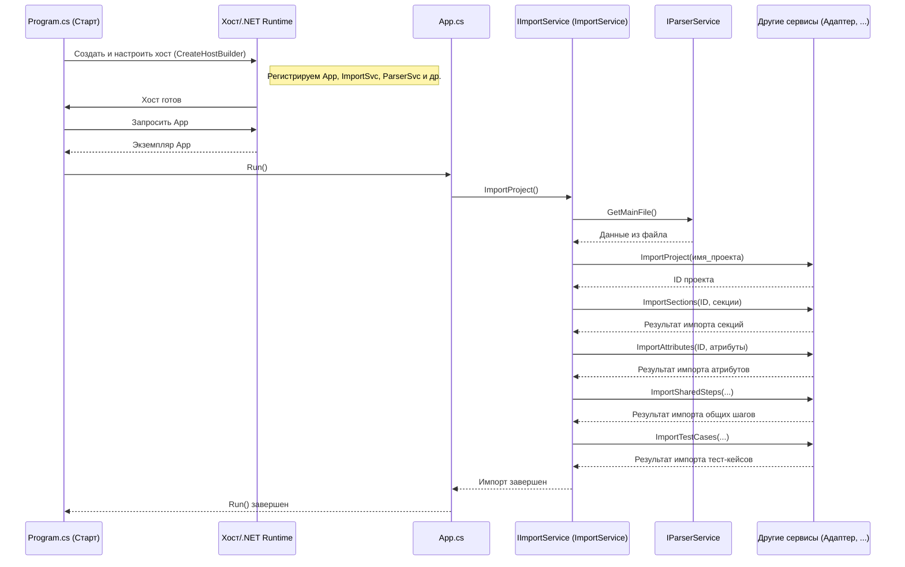

# Chapter 1: Точка входа и Оркестрация импорта (Program, App, IImportService)


Добро пожаловать в руководство по `Importer`! В этой первой главе мы разберемся, с чего начинается работа нашего приложения и как оно управляет всем процессом импорта данных. Представьте, что `Importer` – это сложный механизм, и нам нужно понять, кто нажимает кнопку "Старт" и кто руководит всеми его частями.

**Проблема:** Как наше приложение `Importer` вообще запускается? И как оно координирует множество шагов – получение данных, их обработку, отправку в Test IT – чтобы все прошло гладко?

**Решение:** В .NET приложениях (на чем и написан `Importer`) есть стандартный способ запуска. У нас это файл `Program.cs`. Он как ключ зажигания для автомобиля. `Program.cs` подготавливает все необходимое и "запускает двигатель" – основной класс нашего приложения, который мы назвали `App`. А уже `App` передает управление главному "дирижеру" – `IImportService` (реализованному в `ImportService`), который и руководит всем "оркестром" импорта.

Давайте разберем этих трех ключевых игроков:

1.  **`Program.cs`**: Точка входа. Запускает приложение, настраивает базовые вещи (логирование, конфигурацию) и регистрирует все нужные компоненты (сервисы).
2.  **`App.cs`**: Главный класс приложения. Получает команду от `Program.cs` и инициирует основной процесс – в нашем случае, импорт.
3.  **`IImportService` / `ImportService`**: Сервис-оркестратор. Получает задачу от `App` и шаг за шагом выполняет импорт, вызывая другие, более специализированные сервисы.

## Запуск Приложения: `Program.cs`

Все начинается с файла `Program.cs`. Это стандартная точка входа для консольных приложений .NET. Его основная задача – подготовить "рабочее место" для нашего приложения.

```csharp
// Файл: Program.cs
namespace Importer;

internal class Program
{
    private static void Main(string[] args)
    {
        // 1. Создаем "хост" - окружение для приложения
        using var host = CreateHostBuilder(args).Build();
        // 2. Получаем доступ к "контейнеру сервисов"
        using var scope = host.Services.CreateScope();
        var services = scope.ServiceProvider;

        try
        {
            // 3. Получаем главный класс App и запускаем его
            services.GetRequiredService<App>().Run(args);
        }
        catch (Exception e)
        {
            Console.WriteLine($"Произошла ошибка: {e.Message}");
        }
    }

    // Метод для настройки хоста и сервисов (упрощено ниже)
    private static IHostBuilder CreateHostBuilder(string[] strings)
    {
        // ... настройка конфигурации, логирования и сервисов ...
        return Host.CreateDefaultBuilder()
            /* ... настройки ... */
            .ConfigureServices((builder, services) =>
            {
                // Регистрация наших сервисов (подробнее ниже)
                services.AddSingleton<IImportService, ImportService>();
                services.AddSingleton<App>();
                // ... регистрация конфигурации, HTTP клиента, парсера, адаптера API и др ...
            });
    }

    // ... Остальные вспомогательные методы ...
}
```

**Объяснение:**

1.  `Main` – это самый первый метод, который выполняется при запуске программы.
2.  `CreateHostBuilder(args).Build()` – здесь происходит магия настройки. Создается "хост" – специальное окружение, которое управляет конфигурацией, логированием (записью событий) и, что самое важное, **сервисами** (компонентами нашего приложения). Мы используем стандартный `Host.CreateDefaultBuilder()` для базовой настройки.
3.  `ConfigureServices` – внутри `CreateHostBuilder` мы говорим хосту, какие "детали" (сервисы) понадобятся нашему приложению. Мы "регистрируем" их здесь. Например, строка `services.AddSingleton<App>()` говорит: "Создай один экземпляр класса `App` и храни его, чтобы мы могли его использовать позже". То же самое для `IImportService` и других. Этот процесс называется **Внедрение Зависимостей (Dependency Injection)** – мы не создаем объекты вручную, а просим систему предоставить их нам, когда они нужны.
4.  `services.GetRequiredService<App>().Run(args)` – после того как все настроено, мы просим у системы наш главный класс `App` и вызываем его метод `Run`, передавая ему аргументы командной строки (если они есть). С этого момента управление переходит к `App`.

## Инициация Импорта: `App.cs`

Класс `App` – это сердце нашего приложения с точки зрения логики запуска. Он очень простой. Его задача – получить сервис-оркестратор (`IImportService`) и попросить его начать импорт.

```csharp
// Файл: App.cs
using Importer.Services;
using Microsoft.Extensions.Logging; // Для логирования

namespace Importer;

// Класс App зависит от логгера и сервиса импорта
public class App(ILogger<App> logger, IImportService importService)
{
    // Главный метод, который вызывается из Program.cs
    public void Run(string[] args)
    {
        logger.LogInformation("Запуск приложения"); // Записываем сообщение в лог

        // Вызываем главный метод сервиса импорта и ждем завершения
        importService.ImportProject().Wait();

        logger.LogInformation("Завершение приложения"); // Записываем сообщение в лог
    }
}
```

**Объяснение:**

*   `public class App(ILogger<App> logger, IImportService importService)`: Это объявление класса `App` с использованием *primary constructor* (особенность C#). Оно означает, что для создания `App` нужны два компонента: `ILogger` (для записи логов) и `IImportService` (наш оркестратор). Благодаря настройке в `Program.cs`, система автоматически предоставит эти компоненты (это и есть Dependency Injection в действии).
*   `Run(string[] args)`: Этот метод вызывается из `Program.cs`.
*   `logger.LogInformation(...)`: Мы используем логгер для записи информационных сообщений о ходе работы.
*   `importService.ImportProject().Wait()`: Самая важная строка! Мы обращаемся к нашему сервису импорта (`importService`) и вызываем его метод `ImportProject()`, который выполняет всю работу по импорту. `.Wait()` используется для ожидания завершения асинхронной операции импорта.

## Оркестрация Импорта: `IImportService` и `ImportService.cs`

`IImportService` – это контракт (интерфейс), который определяет, *что* должен уметь делать сервис импорта. В нашем случае, он должен уметь импортировать проект (`ImportProject`).

```csharp
// Файл: Services/IImportService.cs
namespace Importer.Services;

// Интерфейс определяет контракт для сервиса импорта
public interface IImportService
{
    // Метод для запуска импорта всего проекта
    Task ImportProject();
}
```

**Объяснение:**

*   Интерфейс `IImportService` говорит: "Любой класс, который хочет быть сервисом импорта, должен предоставить метод `ImportProject`". Это помогает делать код более гибким и тестируемым.

Реализует этот интерфейс класс `ImportService`. Он действует как дирижер оркестра, управляя последовательностью шагов импорта.

```csharp
// Файл: Services/Implementations/ImportService.cs
using Importer.Client;
using Importer.Models; // Модели данных
using Microsoft.Extensions.Logging; // Логирование

namespace Importer.Services.Implementations;

// Реализация сервиса импорта
internal class ImportService(
    ILogger<ImportService> logger,
    IParserService parserService,         // Сервис для чтения данных
    IClientAdapter clientAdapter,         // Адаптер для API Test IT
    IAttributeService attributeService,   // Сервис импорта атрибутов
    ISectionService sectionService,       // Сервис импорта секций
    ISharedStepService sharedStepService, // Сервис импорта общих шагов
    ITestCaseService testCaseService,     // Сервис импорта тест-кейсов
    IProjectService projectService        // Сервис импорта (создания) проекта
    ) : IImportService // Реализуем интерфейс IImportService
{
    // Метод, который выполняет всю работу
    public async Task ImportProject()
    {
        logger.LogInformation("Начинаем импорт проекта");

        // 1. Получить данные из файла с помощью сервиса парсинга
        var mainJsonResult = await parserService.GetMainFile();
        logger.LogDebug("Данные из файла получены");

        // 2. Создать или найти проект в Test IT
        var projectId = await projectService.ImportProject(mainJsonResult.ProjectName);
        logger.LogDebug($"Проект ID: {projectId}");

        // 3. Импортировать секции (папки)
        var sections = await sectionService.ImportSections(projectId, mainJsonResult.Sections);
        logger.LogDebug("Секции импортированы");

        // 4. Импортировать атрибуты (пользовательские поля)
        var attributesMap = await attributeService.ImportAttributes(projectId, mainJsonResult.Attributes);
        logger.LogDebug("Атрибуты импортированы");

        // 5. Импортировать общие шаги
        var sharedSteps = await sharedStepService.ImportSharedSteps(projectId, mainJsonResult.SharedSteps, sections, attributesMap);
        logger.LogDebug("Общие шаги импортированы");

        // 6. Импортировать тест-кейсы
        await testCaseService.ImportTestCases(projectId, mainJsonResult.TestCases, sections, attributesMap, sharedSteps);
        logger.LogDebug("Тест-кейсы импортированы");

        logger.LogInformation("Импорт проекта завершен");
    }
}
```

**Объяснение:**

*   `internal class ImportService(...) : IImportService`: Класс `ImportService` реализует интерфейс `IImportService`. Он также использует Dependency Injection для получения всех необходимых ему сервисов (парсер, адаптер API, сервисы для импорта атрибутов, секций и т.д.).
*   `ImportProject()`: Этот асинхронный (`async Task`) метод содержит логику оркестровки:
    1.  Вызывает [Сервис парсинга данных (IParserService)](03_сервис_парсинга_данных__iparserservice__.md) для чтения данных из исходного файла (например, JSON).
    2.  Вызывает `IProjectService` для создания (или получения ID существующего) проекта в Test IT.
    3.  Вызывает [Сервисы импорта сущностей (IAttributeService, ISectionService, ITestCaseService и др.)](06_сервисы_импорта_сущностей__iattributeservice__isectionservice__itestcaseservice_и_др___.md) в определенном порядке (сначала секции и атрибуты, потом общие шаги, потом тест-кейсы), передавая им необходимые данные (ID проекта, данные из парсера, результаты предыдущих шагов). Все взаимодействие с Test IT происходит через [Адаптер API Test IT (IClientAdapter)](04_адаптер_api_test_it__iclientadapter__.md), который используется внутри этих сервисов.
*   Обратите внимание на логирование (`logger.LogInformation`, `logger.LogDebug`). Это помогает отслеживать, что происходит на каждом шаге.

## Общая Картина: Как все связано

Давайте представим весь процесс запуска и импорта в виде простой диаграммы последовательности:



Эта диаграмма показывает, как управление передается от `Program.cs` к `App`, затем к `ImportService`, который, в свою очередь, вызывает другие сервисы для выполнения конкретных задач импорта.

## Заключение

В этой главе мы узнали, как устроен запуск приложения `Importer` и как координируется процесс импорта:

1.  **`Program.cs`**: Является точкой входа, настраивает окружение и все необходимые сервисы с помощью механизма **Dependency Injection**.
2.  **`App.cs`**: Получает управление от `Program.cs`, и его главная задача – инициировать процесс импорта, вызвав `IImportService`.
3.  **`IImportService` (реализованный в `ImportService`)**: Выступает в роли **оркестратора** или **дирижера**. Он определяет последовательность шагов импорта и вызывает соответствующие специализированные сервисы для выполнения каждого шага (парсинг, создание проекта, импорт секций, атрибутов, тест-кейсов и т.д.).

Теперь, когда мы понимаем общую структуру запуска и управления, в следующей главе мы подробнее рассмотрим, как настраивается приложение с помощью конфигурационных файлов.

---

**Следующая глава:** [Глава 2: Конфигурация приложения (AppConfig)](02_конфигурация_приложения__appconfig__.md)

---

Generated by [AI Codebase Knowledge Builder](https://github.com/The-Pocket/Tutorial-Codebase-Knowledge)