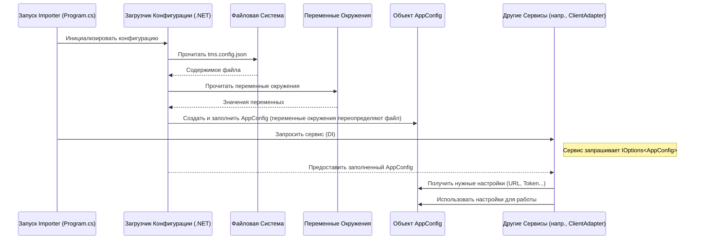

# Chapter 2: Конфигурация приложения (AppConfig)


В [предыдущей главе](01_точка_входа_и_оркестрация_импорта__program__app__iimportservice__.md) мы разобрались, как наш `Importer` запускается и кто управляет всем процессом импорта. Мы узнали про точку входа `Program.cs`, главный класс `App` и "дирижера"
`IImportService`. Но чтобы импорт прошел успешно, нашему приложению нужна важная информация: куда загружать данные? Откуда их брать? Как подключиться к системе Test IT?

**Проблема:** Откуда `Importer` знает, к какому серверу Test IT подключаться, какой проект использовать, какой API-токен применить и где лежат файлы с результатами, которые нужно импортировать? Жестко прописывать эти данные прямо в коде – плохая идея, ведь они могут часто меняться.

**Решение:** Для хранения таких настроек используется **конфигурация**. В нашем `Importer` за конфигурацию отвечает класс `AppConfig`. Он работает как **паспорт** для нашего приложения перед "поездкой" (импортом): содержит всю критически важную информацию (адрес Test IT, токен доступа, название проекта, путь к файлам), без которой "путешествие" просто не начнется. Эти данные считываются из внешнего файла `tms.config.json` и, опционально, из переменных окружения системы.

## Что такое `AppConfig` и зачем он нужен?

Представьте, вы собираетесь в путешествие в другую страну. Вам нужен паспорт, где указано ваше имя, куда вы едете, возможно, номер визы. Без паспорта вас просто не пустят.

`AppConfig` – это и есть такой "паспорт" для нашего `Importer`. Это специальный класс в коде, который хранит все настройки, необходимые для работы:

1.  **`ResultPath`**: Путь к папке, где лежат данные для импорта (результаты экспорта из другой системы). Как адрес отправления в путешествии.
2.  **`Tms` (Настройки Test IT)**: Это отдельный "раздел паспорта", посвященный пункту назначения – Test IT. Он содержит:
    *   `Url`: Адрес вашего сервера Test IT (куда едем).
    *   `PrivateToken`: Секретный ключ (API токен) для доступа к Test IT (ваша виза/пропуск).
    *   `ProjectName`: Название проекта в Test IT, куда будут импортироваться данные.
    *   `CertValidation`: Настройка, указывающая, нужно ли проверять SSL-сертификат сервера Test IT (доверяем ли мы этому "посольству").
    *   `ImportToExistingProject`: Флаг, указывающий, нужно ли импортировать в существующий проект или создавать новый.
    *   `Timeout`: Максимальное время ожидания ответа от сервера Test IT.

Наличие этих данных в одном месте (`AppConfig`) позволяет другим частям приложения легко получать к ним доступ, не беспокоясь о том, откуда они взялись.

## Откуда берутся настройки: Файл `tms.config.json`

Самый распространенный способ задать настройки для `Importer` – это создать рядом с исполняемым файлом приложения (`Importer.exe` или `Importer`) файл с именем `tms.config.json`. Этот файл имеет простой текстовый формат JSON (JavaScript Object Notation), который легко читать и редактировать.

Вот пример содержимого файла `tms.config.json`:

```json
// Файл: tms.config.json
{
    "resultPath" : "/Users/user01/Documents/importer", // Путь к папке с данными
    "tms" : {
        "url" : "https://demo.testit.software/", // Адрес вашего Test IT
        "privateToken" : "ВашСекретныйТокенЗдесь", // Ваш API токен
        "certValidation" : true, // Проверять сертификат (рекомендуется true)
        "importToExistingProject" : false, // Создать новый проект при импорте
        "projectName" : "Мой Новый Проект", // Имя проекта в Test IT
        "timeout": 600 // Время ожидания ответа (сек), по умолчанию 600 (10 мин)
    }
}
```

**Объяснение:**

*   `resultPath`: Указывает полный путь к папке, где лежат файлы, которые `Importer` будет обрабатывать. **Обязательно** измените это значение на ваш реальный путь!
*   `tms`: Это объект, содержащий настройки для подключения к Test IT.
    *   `url`: Полный URL вашего экземпляра Test IT. **Обязательно** замените на ваш URL!
    *   `privateToken`: Ваш персональный API токен из Test IT. Его можно сгенерировать в профиле пользователя Test IT. **Обязательно** замените на ваш токен! **Никогда не делитесь этим токеном с другими!**
    *   `certValidation`: `true` (проверять сертификат) или `false` (не проверять). Используйте `false` только для тестовых сред с самоподписанными сертификатами.
    *   `importToExistingProject`: Если `true`, `Importer` попытается найти проект с именем `projectName` и импортировать в него. Если `false`, `Importer` создаст новый проект с именем `projectName`.
    *   `projectName`: Имя проекта в Test IT. Если `importToExistingProject` равно `false`, будет создаваться проект с этим именем. Если `importToExistingProject` равно `true`, `Importer` будет искать проект с этим именем.
    *   `timeout`: Время ожидания ответа от сервера в секундах. Если не указано, используется значение по умолчанию (600 секунд).

При запуске `Importer` автоматически ищет этот файл, читает его и "заполняет" данными объект `AppConfig`.

**Важно:** `Importer` также может считывать эти настройки из **переменных окружения**. Переменные окружения имеют **приоритет** над файлом `tms.config.json`. Это может быть полезно в системах автоматической сборки и развертывания (CI/CD). Например, переменная окружения `tms__privateToken` переопределит значение `privateToken` из секции `tms` в файле. Двойное подчеркивание `__` используется для обозначения вложенности.

## Как это работает "под капотом"?

Давайте посмотрим на упрощенную схему, как `Importer` получает конфигурацию:



**По шагам:**

1.  **Запуск:** При старте приложения (`Program.cs`) запускается механизм конфигурации .NET.
2.  **Чтение Источников:** Он сначала читает файл `tms.config.json`, а затем переменные окружения.
3.  **Заполнение `AppConfig`:** На основе прочитанных данных создается и заполняется объект класса `AppConfig`. Если одна и та же настройка есть и в файле, и в переменных окружения, значение из переменной окружения будет иметь приоритет.
4.  **Валидация:** Происходит проверка корректности данных (например, что URL указан правильно).
5.  **Доступность:** Заполненный и проверенный объект `AppConfig` становится доступным для других частей приложения через механизм [Внедрения Зависимостей (Dependency Injection)](01_точка_входа_и_оркестрация_импорта__program__app__iimportservice__.md), обычно через интерфейс `IOptions<AppConfig>`.
6.  **Использование:** Любой сервис, которому нужны настройки (например, [Адаптер API Test IT (IClientAdapter)](04_адаптер_api_test_it__iclientadapter__.md) для подключения к Test IT), может запросить `IOptions<AppConfig>` и получить доступ к нужным значениям (`Url`, `PrivateToken` и т.д.).

## Взгляд на код

Давайте посмотрим на ключевые фрагменты кода, связанные с конфигурацией.

**1. Модели данных (`AppConfig.cs`)**

Эти классы просто описывают структуру нашего "паспорта".

```csharp
// Файл: Models/AppConfig.cs
using System.ComponentModel.DataAnnotations; // Для атрибутов валидации

namespace Importer.Models;

// Главный класс конфигурации
public class AppConfig
{
    // [Required] означает, что это поле обязательно должно быть в конфигурации
    [Required] public string ResultPath { get; set; } = string.Empty; // Путь к результатам

    [Required] public TmsConfig Tms { get; set; } = new(); // Настройки Test IT
}

// Класс для настроек подключения к Test IT
public class TmsConfig
{
    [Required] public string Url { get; set; } = string.Empty; // URL сервера
    [Required] public string PrivateToken { get; set; } = string.Empty; // Токен доступа

    // Необязательные параметры с значениями по умолчанию
    public bool CertValidation { get; set; } = true; // Проверка сертификата
    public int Timeout { get; set; } // Таймаут (установится в валидаторе, если 0)
    public string ProjectName { get; set; } = string.Empty; // Имя проекта
    public bool ImportToExistingProject { get; set; } // Импорт в существующий проект
}
```

**Объяснение:**

*   Мы видим два класса: `AppConfig` и вложенный `TmsConfig`, которые точно соответствуют структуре нашего JSON-файла.
*   Атрибуты `[Required]` указывают, что поля `ResultPath`, `Tms`, `Tms.Url` и `Tms.PrivateToken` являются обязательными. Если их не будет в конфигурации, приложение не запустится и выдаст ошибку.

**2. Настройка чтения конфигурации (`Program.cs`)**

В главном файле `Program.cs` мы указываем, откуда брать настройки.

```csharp
// Файл: Program.cs (фрагмент метода CreateHostBuilder)

// ... другие настройки ...

.ConfigureServices((builder, services) =>
{
    // ... регистрация других сервисов ...

    // Регистрируем сервис конфигурации
    services.AddSingleton(SetupConfiguration());
    // Регистрируем наш AppConfig и настраиваем его чтение
    services.RegisterAppConfig();

    // ... регистрация остальных сервисов ...
});

// ...

// Метод, который настраивает источники конфигурации
private static IConfiguration SetupConfiguration()
{
    return new ConfigurationBuilder()
        // Устанавливаем базовый путь (где искать файл) - текущая директория
        .SetBasePath(Directory.GetCurrentDirectory())
        // Добавляем чтение из JSON файла
        .AddJsonFile("tms.config.json")
        // Добавляем чтение из переменных окружения (переопределяют JSON)
        .AddEnvironmentVariables()
        // Собираем конфигурацию
        .Build();
}
```

**Объяснение:**

*   Метод `SetupConfiguration` создает объект `IConfiguration`.
*   `SetBasePath(Directory.GetCurrentDirectory())` говорит, что файл `tms.config.json` нужно искать в той же папке, где запущено приложение.
*   `AddJsonFile("tms.config.json")` указывает читать настройки из этого файла.
*   `AddEnvironmentVariables()` указывает читать настройки из переменных окружения. Важно, что этот метод вызывается *после* `AddJsonFile`, поэтому переменные окружения имеют приоритет.
*   Затем в `ConfigureServices` мы регистрируем эту конфигурацию (`AddSingleton(SetupConfiguration())`) и вызываем специальный метод `RegisterAppConfig` (см. ниже).

**3. Регистрация и привязка `AppConfig` (`Extensions/ServiceCollectionExtensions.cs`)**

Этот метод связывает прочитанную конфигурацию с нашим классом `AppConfig` и делает его доступным для других сервисов.

```csharp
// Файл: Extensions/ServiceCollectionExtensions.cs
using Importer.Models;
using Importer.Validators; // Для валидатора
using Microsoft.Extensions.DependencyInjection;
using Microsoft.Extensions.Options; // Для IOptions

public static class ServiceCollectionExtensions
{
    public static void RegisterAppConfig(this IServiceCollection services)
    {
        services
            // Настраиваем AppConfig как "опции" приложения
            .AddOptions<AppConfig>()
            // Привязываем ("биндим") секции из IConfiguration к свойствам AppConfig
            .BindConfiguration("") // Пустая строка означает привязку от корня конфигурации
            // Включаем стандартную проверку атрибутов ([Required] и т.д.)
            .ValidateDataAnnotations()
            // Включаем проверку при старте приложения
            .ValidateOnStart();

        // Регистрируем наш собственный класс для дополнительной валидации
        services.AddSingleton<IValidateOptions<AppConfig>, AppConfigValidator>();

        // ... код для логирования таймаута ...
    }

    // ... другие методы расширения (напр., RegisterClient) ...
}
```

**Объяснение:**

*   `AddOptions<AppConfig>()` регистрирует `AppConfig` в системе конфигурации как "опции".
*   `BindConfiguration("")` – это ключевой момент! Он автоматически сопоставляет имена полей в прочитанной конфигурации (из JSON и переменных окружения) со свойствами класса `AppConfig` и `TmsConfig` и заполняет их. Пустая строка `""` означает, что `ResultPath` и `Tms` ищутся на верхнем уровне конфигурации.
*   `ValidateDataAnnotations()` включает проверку атрибутов вроде `[Required]`.
*   `ValidateOnStart()` заставляет систему проверить конфигурацию сразу при запуске приложения.
*   `AddSingleton<IValidateOptions<AppConfig>, AppConfigValidator>()` регистрирует наш кастомный валидатор (см. ниже).

**4. Валидация настроек (`Validators/AppConfigValidator.cs`)**

Этот класс выполняет дополнительную проверку и установку значений по умолчанию.

```csharp
// Файл: Validators/AppConfigValidator.cs
using Importer.Models;
using Microsoft.Extensions.Options;

namespace Importer.Validators;

public class AppConfigValidator : IValidateOptions<AppConfig>
{
    // Таймаут по умолчанию в секундах (10 минут)
    private const int DefaultTimeoutInSec = 10 * 60;

    public ValidateOptionsResult Validate(string? name, AppConfig options)
    {
        // Проверяем, что путь к результатам не пустой
        if (string.IsNullOrEmpty(options.ResultPath))
            return ValidateOptionsResult.Fail("ResultPath не может быть пустым.");

        // Проверяем, что URL в TMS указан и является корректным URI
        if (string.IsNullOrEmpty(options.Tms.Url) || !Uri.IsWellFormedUriString(options.Tms.Url, UriKind.Absolute))
            return ValidateOptionsResult.Fail("Tms.Url должен быть корректным URL.");

        // Если таймаут не был задан (равен 0), устанавливаем значение по умолчанию
        if (options.Tms.Timeout == 0)
        {
            options.Tms.Timeout = DefaultTimeoutInSec;
        }

        // Если все проверки прошли успешно
        return ValidateOptionsResult.Success;
    }
}
```

**Объяснение:**

*   Класс реализует интерфейс `IValidateOptions<AppConfig>`.
*   Метод `Validate` получает объект `options` (заполненный `AppConfig`) и выполняет проверки:
    *   Проверяет, что `ResultPath` не пустой.
    *   Проверяет, что `Tms.Url` не пустой и имеет формат URL.
    *   Устанавливает `Tms.Timeout` в значение по умолчанию (`DefaultTimeoutInSec`), если он не был задан в `tms.config.json` или переменных окружения.
*   Если проверка не проходит, `ValidateOptionsResult.Fail` возвращает ошибку, и приложение не запустится. Если все хорошо, возвращается `ValidateOptionsResult.Success`.

**5. Использование конфигурации в другом сервисе (Пример)**

Вот как, например, [Адаптер API Test IT (IClientAdapter)](04_адаптер_api_test_it__iclientadapter__.md) может получить доступ к конфигурации:

```csharp
// Файл: Client/Implementations/ClientAdapter.cs (Упрощенный пример)
using Importer.Models;
using Microsoft.Extensions.Options; // Для IOptions
using TestIT.ApiClient.Api; // Используемые API клиенты

namespace Importer.Client.Implementations;

// Адаптер зависит от IOptions<AppConfig> и IHttpClientFactory
internal class ClientAdapter : IClientAdapter
{
    private readonly AppConfig _config; // Храним конфигурацию локально
    private readonly TestIT.ApiClient.Client.IClient _client; // Клиент Test IT

    // DI внедряет IOptions<AppConfig> и IHttpClientFactory
    public ClientAdapter(IOptions<AppConfig> config, IHttpClientFactory factory)
    {
        // Получаем сам объект AppConfig из 'обертки' IOptions
        _config = config.Value;

        // Создаем клиент Test IT, используя URL и Токен из конфигурации
        _client = new TestIT.ApiClient.Client.Client(
             factory.CreateClient("ClientApi"), // Используем настроенный HttpClient
            _config.Tms.Url,
            _config.Tms.PrivateToken
        );
    }

    // Пример использования клиента в методе адаптера
    public async Task<List<Guid>> GetWorkItemIds(string projectId)
    {
        var api = new WorkItemsApi(_client); // Создаем API объект, передавая ему клиент
        // Используем API для получения данных из Test IT
        var workItems = await api.ApiV2WorkItemsSearchPostAsync(/* параметры поиска */);
        // ... обработка результата ...
        return /* список ID */;
    }

    // ... другие методы адаптера ...
}
```

**Объяснение:**

*   Класс `ClientAdapter` через конструктор запрашивает `IOptions<AppConfig>`. Система DI автоматически предоставляет ему экземпляр, содержащий "обертку" над нашим заполненным `AppConfig`.
*   Мы получаем сам объект конфигурации через `config.Value`.
*   Далее мы используем значения `_config.Tms.Url` и `_config.Tms.PrivateToken` для настройки клиента Test IT API.
*   Таким образом, `ClientAdapter` может подключаться к нужному серверу Test IT, используя учетные данные, заданные пользователем в файле `tms.config.json`, не зная деталей того, как эта конфигурация была прочитана.

## Заключение

В этой главе мы узнали о "паспорте" нашего приложения – конфигурации `AppConfig`:

1.  **Назначение:** `AppConfig` хранит все внешние настройки, необходимые для работы `Importer`, такие как пути к файлам и параметры подключения к Test IT.
2.  **Источник:** Настройки обычно задаются в файле `tms.config.json` в формате JSON, который легко редактировать. Также их можно переопределить через переменные окружения.
3.  **Структура:** Классы `AppConfig` и `TmsConfig` в коде отражают структуру конфигурационных данных.
4.  **Процесс:** Приложение при старте читает файл и переменные окружения, заполняет объект `AppConfig`, валидирует его и делает доступным другим компонентам через `IOptions<AppConfig>`.
5.  **Польза:** Использование конфигурации делает приложение гибким, позволяя легко менять настройки без перекомпиляции кода.

Теперь, когда мы знаем, как настроить `Importer` для подключения к Test IT и где указать путь к исходным данным, в следующей главе мы рассмотрим, как именно `Importer` читает и разбирает (парсит) эти исходные данные.

---

**Следующая глава:** [Глава 3: Сервис парсинга данных (IParserService)](03_сервис_парсинга_данных__iparserservice__.md)

---

Generated by [AI Codebase Knowledge Builder](https://github.com/The-Pocket/Tutorial-Codebase-Knowledge)