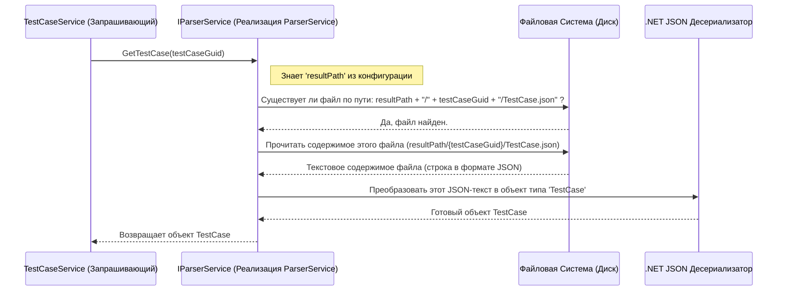

# Chapter 3: Сервис парсинга данных (IParserService)


В [предыдущей главе](02_конфигурация_приложения__appconfig__.md) мы разобрались, как настраивается наш `Importer` – где он хранит свой "паспорт" (`AppConfig`) с важной информацией, такой как адрес Test IT и, что особенно важно для этой главы, путь к папке с данными для импорта (`ResultPath`). Мы знаем, *где* лежат наши данные.

**Проблема:** Но как `Importer` сможет *прочитать* и *понять* содержимое этой папки? Данные там не свалены в одну кучу – они организованы в определенную структуру: есть главный файл `Main.json`, есть отдельные папки для каждого тест-кейса и общего шага, содержащие свои JSON-файлы и файлы вложений (картинки, документы). Как приложение узнает, какой файл открыть, как извлечь из него нужную информацию (например, шаги тест-кейса) и как получить доступ к вложениям?

**Решение:** Для решения этой задачи в `Importer` существует специальный компонент – **Сервис парсинга данных**, представленный интерфейсом `IParserService`. Представьте его как **библиотекаря** в большой библиотеке (ваша папка `ResultPath`). Этот библиотекарь точно знает, на какой полке (в какой папке) лежит нужная "книга" (файл `Main.json`, `TestCase.json`, `SharedStep.json`) или "иллюстрация" (файл вложения). Он не просто находит книгу, но и умеет "прочитать" ее содержимое (десериализовать JSON) или предоставить вам доступ к иллюстрации (открыть файл вложения).

## Что такое `IParserService` и что он умеет?

`IParserService` – это наш "эксперт" по чтению данных из папки, указанной в `ResultPath`. Его основные задачи:

1.  **Читать главный файл (`Main.json`):** Этот файл содержит общую информацию о проекте, список всех тест-кейсов, общих шагов, секций и атрибутов для импорта. `IParserService` предоставляет метод `GetMainFile()`, чтобы получить эту информацию в виде удобного объекта.
2.  **Читать данные тест-кейса:** Для каждого тест-кейса есть отдельная папка (названная по его уникальному ID - GUID) и внутри нее файл `TestCase.json` с деталями (шаги, предусловия и т.д.). Метод `GetTestCase(guid)` позволяет получить данные конкретного тест-кейса по его ID.
3.  **Читать данные общего шага:** Аналогично тест-кейсам, общие шаги хранятся в своих папках с файлом `SharedStep.json`. Метод `GetSharedStep(guid)` используется для их чтения.
4.  **Предоставлять доступ к вложениям:** Если к тест-кейсам или шагам прикреплены файлы (картинки, документы), они лежат в тех же папках. Метод `GetAttachment(guid, fileName)` позволяет получить доступ к конкретному файлу вложения, зная ID родительского элемента (тест-кейса/шага) и имя файла.

Наш "библиотекарь" (`IParserService`) имеет четкие инструкции (методы), которые говорят ему, что именно нужно найти и как это предоставить:

*   `GetMainFile()` – "Дай мне главный каталог библиотеки."
*   `GetTestCase(guid)` – "Найди книгу с номером `guid` и прочитай ее содержание."
*   `GetSharedStep(guid)` – "Найди инструкцию с номером `guid` и прочитай ее содержание."
*   `GetAttachment(guid, fileName)` – "Найди иллюстрацию `fileName` в разделе `guid` и дай мне ее посмотреть."

## Как это работает (Общая схема)

Давайте представим процесс взаимодействия:

1.  **Запрос:** Другой сервис, например, главный "дирижер" [IImportService](01_точка_входа_и_оркестрация_импорта__program__app__iimportservice__.md), решает, что ему нужна информация из главного файла.
2.  **Обращение к "Библиотекарю":** `ImportService` обращается к `IParserService` и вызывает метод `GetMainFile()`.
3.  **Поиск:** `IParserService`, зная путь `ResultPath` (из конфигурации), ищет файл `Main.json` в этой папке.
4.  **Чтение:** Он открывает файл `Main.json` и читает его текстовое содержимое.
5.  **"Перевод" (Десериализация):** Так как это JSON-файл, `IParserService` преобразует (десериализует) этот текст в понятную для C# структуру – объект `Root`.
6.  **Возврат результата:** `IParserService` возвращает готовый объект `Root` сервису `ImportService`.

Аналогично происходит и для других запросов: `GetTestCase` найдет папку по GUID, прочитает `TestCase.json` и вернет объект `TestCase`; `GetAttachment` найдет нужный файл и вернет способ (`FileStream`) его прочитать.

## Примеры использования `IParserService`

Давайте посмотрим, как другие части `Importer` используют нашего "библиотекаря".

**Пример 1: Получение данных из `Main.json`**

Это обычно происходит в самом начале импорта в сервисе `ImportService`.

```csharp
// Фрагмент из Services/Implementations/ImportService.cs
// Предположим, что 'parserService' - это наш экземпляр IParserService

// Запрашиваем данные из главного файла
var mainJsonResult = await parserService.GetMainFile();

// Теперь переменная 'mainJsonResult' содержит объект Root,
// представляющий структуру файла Main.json.
// Мы можем легко получить доступ к разным частям:
logger.LogInformation($"Импортируем проект: {mainJsonResult.ProjectName}");
var testCaseIds = mainJsonResult.TestCases; // Получаем список ID всех тест-кейсов
var sectionData = mainJsonResult.Sections; // Получаем данные о секциях
// ... и так далее
```

**Объяснение:**

*   Мы вызываем `parserService.GetMainFile()`.
*   Никаких входных параметров не нужно – сервис уже знает `ResultPath`.
*   Результатом является объект `Root`, который содержит всю информацию из `Main.json` (имя проекта, списки ID тест-кейсов, общих шагов, структуру секций и атрибутов). `ImportService` использует эти данные для дальнейшей оркестровки импорта.

**Пример 2: Чтение данных конкретного тест-кейса**

Это происходит внутри [сервиса импорта тест-кейсов (ITestCaseService)](06_сервисы_импорта_сущностей__iattributeservice__isectionservice__itestcaseservice_и_др___.md), когда он обрабатывает список ID из `Main.json`.

```csharp
// Фрагмент из Services/Implementations/TestCaseService.cs
// Предположим, 'parserService' - это IParserService,
// а 'testCaseIdToImport' - это GUID тест-кейса из списка Main.json
// (например, полученный в цикле foreach (var testCaseIdToImport in mainJsonResult.TestCases) ...)

Guid testCaseIdToImport = Guid.Parse("..."); // Пример ID

// Запрашиваем данные для этого конкретного тест-кейса
var testCaseData = await parserService.GetTestCase(testCaseIdToImport);

// Теперь 'testCaseData' содержит объект TestCase со всеми деталями:
var steps = testCaseData.Steps; // Получаем список шагов
var preconditions = testCaseData.PreconditionSteps; // Получаем предусловия
var attributes = testCaseData.Attributes; // Атрибуты этого тест-кейса
// ... и так далее
```

**Объяснение:**

*   Мы вызываем `parserService.GetTestCase()`, передавая ему уникальный идентификатор (`Guid`) нужного тест-кейса.
*   Сервис находит папку с этим `Guid`, читает `TestCase.json` внутри нее.
*   Результатом является объект `TestCase`, содержащий все детали этого тест-кейса (шаги, атрибуты, связи и т.д.), готовые для отправки в Test IT.

**Пример 3: Получение файла вложения**

Это может происходить там же, в `ITestCaseService`, при обработке шагов тест-кейса, если шаг содержит вложение.

```csharp
// Фрагмент из Services/Implementations/TestCaseService.cs
// Предположим, 'parserService' - это IParserService,
// 'clientAdapter' - это адаптер к API Test IT,
// 'attachmentFolderGuid' - это ID тест-кейса (или шага), к которому относится вложение,
// 'attachmentFilename' - имя файла вложения, полученное из данных шага.

Guid attachmentFolderGuid = Guid.Parse("..."); // ID тест-кейса
string attachmentFilename = "screenshot.png";   // Имя файла

// Запрашиваем поток для чтения файла вложения
await using var attachmentStream = await parserService.GetAttachment(
    attachmentFolderGuid,
    attachmentFilename
);

// Теперь 'attachmentStream' - это поток данных файла.
// Мы можем передать его адаптеру API для загрузки в Test IT.
logger.LogInformation("Загрузка вложения: {Filename}", attachmentFilename);
var uploadedAttachmentId = await clientAdapter.UploadAttachment(
    attachmentStream,
    attachmentFilename
);
// Используем 'uploadedAttachmentId' дальше при создании тест-кейса в Test IT
```

**Объяснение:**

*   Мы вызываем `parserService.GetAttachment()`, передавая ID папки (`Guid`) и имя файла (`string`).
*   Сервис находит файл по указанному пути (`ResultPath/{Guid}/{fileName}`).
*   Результатом является `FileStream` – объект, который позволяет читать содержимое файла по частям.
*   Этот поток затем используется для загрузки файла в Test IT через [Адаптер API Test IT (IClientAdapter)](04_адаптер_api_test_it__iclientadapter__.md). Ключевое слово `await using` гарантирует, что файл будет корректно закрыт после использования.

## Как это устроено "под капотом"?

Чтобы наш "библиотекарь" (`IParserService`) мог находить нужные файлы, он ожидает определенную структуру папок и файлов внутри директории, указанной в `ResultPath`.

**Ожидаемая структура файлов:**

```
<Ваш_ResultPath>/          <-- Папка, указанная в tms.config.json
├── Main.json              <-- Главный файл с общей информацией
│
├── {GUID_ТестКейса_1}/      <-- Папка для первого тест-кейса (имя = его ID)
│   ├── TestCase.json      <-- Детали этого тест-кейса
│   └── скриншот.png       <-- Файл вложения для этого тест-кейса
│
├── {GUID_ТестКейса_2}/      <-- Папка для второго тест-кейса
│   ├── TestCase.json      <-- Детали второго тест-кейса
│   └── отчет.docx         <-- Другое вложение
│
├── {GUID_ОбщегоШага_1}/   <-- Папка для первого общего шага
│   └── SharedStep.json    <-- Детали этого общего шага
│
└── ...                   <-- Другие папки для тест-кейсов и общих шагов
```

**Процесс получения данных тест-кейса (на примере `GetTestCase`)**

Представим, что `TestCaseService` запросил данные для тест-кейса с определенным `testCaseGuid`:



**Погружение в код (`ParserService.cs`)**

Реализация интерфейса `IParserService` находится в классе `ParserService`. Давайте посмотрим на ключевые моменты.

**1. Конструктор: Получение пути к данным**

При создании `ParserService` получает доступ к общей конфигурации приложения и извлекает из нее `ResultPath`.

```csharp
// Файл: Services/Implementations/ParserService.cs (Конструктор)
internal class ParserService : IParserService
{
    private readonly string _resultPath; // Место для хранения пути
    private readonly ILogger<ParserService> _logger; // Для записи логов
    // Настройки для корректного чтения JSON
    private readonly JsonSerializerOptions _jsonSerializerOptions = new() { /* ... */ };

    // Конструктор получает логгер и конфигурацию через Dependency Injection
    public ParserService(ILogger<ParserService> logger, IConfiguration configuration)
    {
        _logger = logger;
        // Получаем значение 'resultPath' из конфигурации
        var resultPath = configuration["resultPath"];
        if (string.IsNullOrEmpty(resultPath))
        {
            // Если путь не задан в tms.config.json - выбрасываем ошибку
            _logger.LogError("Параметр resultPath не задан в конфигурации!");
            throw new ArgumentException("resultPath is not set");
        }
        // ... (проверка корректности разделителей пути для ОС) ...

        // Сохраняем путь в приватном поле для использования другими методами
        _resultPath = resultPath;
        _logger.LogInformation("Сервис парсинга будет использовать путь: {Path}", _resultPath);
    }
    // ... остальные методы ...
}
```

**Объяснение:**

*   `IConfiguration configuration`: Этот объект содержит все настройки, прочитанные из `tms.config.json` и переменных окружения (как мы видели в [Главе 2](02_конфигурация_приложения__appconfig__.md)).
*   `configuration["resultPath"]`: Извлекаем значение настройки `resultPath`.
*   `_resultPath = resultPath;`: Сохраняем полученный путь в поле `_resultPath`, чтобы методы `GetMainFile`, `GetTestCase` и др. могли его использовать.

**2. Реализация `GetMainFile`**

Этот метод отвечает за чтение `Main.json`.

```csharp
// Файл: Services/Implementations/ParserService.cs (GetMainFile)
public async Task<Root> GetMainFile()
{
    // Собираем полный путь к файлу: <ResultPath>/Main.json
    // Path.Combine - умный способ соединить части пути, не думая о слешах (\ или /)
    var mainJsonPath = Path.Combine(_resultPath, Constants.MainJson); // Constants.MainJson это "Main.json"

    // Проверяем, существует ли файл по этому пути
    if (!File.Exists(mainJsonPath))
    {
        _logger.LogError("Главный файл конфигурации Main.json не найден по пути: {Path}", mainJsonPath);
        throw new FileNotFoundException("Main json file not found"); // Ошибка, если файла нет
    }

    _logger.LogDebug("Чтение файла: {Path}", mainJsonPath);
    // Асинхронно читаем все содержимое файла в виде текста
    var mainJson = await File.ReadAllTextAsync(mainJsonPath);

    // Преобразуем (десериализуем) прочитанный JSON-текст в объект типа Root
    // Используем наши настройки _jsonSerializerOptions для правильной обработки
    var root = JsonSerializer.Deserialize<Root>(mainJson, _jsonSerializerOptions);

    // Проверяем, что десериализация прошла успешно
    if (root == null)
    {
        _logger.LogError("Не удалось разобрать содержимое файла Main.json: {Path}", mainJsonPath);
        throw new ApplicationException("Main json file is empty or invalid");
    }

    // Возвращаем готовый объект Root
    return root;
}
```

**Объяснение:**

*   `Path.Combine(_resultPath, Constants.MainJson)`: Безопасно формирует полный путь к файлу `Main.json` в папке `_resultPath`.
*   `File.Exists()`: Проверяет наличие файла перед чтением.
*   `File.ReadAllTextAsync()`: Асинхронно читает весь файл.
*   `JsonSerializer.Deserialize<Root>()`: Самый важный шаг – превращает текстовый JSON в объект `Root`, с которым может работать остальная часть приложения. [Модели данных](05_модели_данных_tms__tmstestcase__tmsattribute_и_др___.md) (как `Root`, `TestCase`) определяют, какую структуру ожидать в JSON.

**3. Реализация `GetTestCase`**

Логика очень похожа на `GetMainFile`, но путь строится иначе.

```csharp
// Файл: Services/Implementations/ParserService.cs (GetTestCase)
public async Task<TestCase> GetTestCase(Guid guid) // Принимает ID тест-кейса
{
    // Собираем путь к папке тест-кейса: <ResultPath>/{guid}
    // И затем к файлу внутри нее: <ResultPath>/{guid}/TestCase.json
    var testCasePath = Path.Combine(_resultPath, guid.ToString(), Constants.TestCase); // Const: "TestCase.json"

    if (!File.Exists(testCasePath))
    {
        _logger.LogError("Файл данных тест-кейса TestCase.json не найден: {Path}", testCasePath);
        throw new ApplicationException($"Test case file not found for GUID: {guid}");
    }

    _logger.LogDebug("Чтение файла тест-кейса: {Path}", testCasePath);
    var testCaseJson = await File.ReadAllTextAsync(testCasePath);
    var testCase = JsonSerializer.Deserialize<TestCase>(testCaseJson, _jsonSerializerOptions);

    if (testCase == null)
    {
         _logger.LogError("Не удалось разобрать содержимое файла TestCase.json: {Path}", testCasePath);
        throw new ApplicationException($"Test case file is empty or invalid for GUID: {guid}");
    }

    return testCase; // Возвращаем объект TestCase
}
```

**Объяснение:**

*   `Path.Combine(_resultPath, guid.ToString(), Constants.TestCase)`: Здесь путь собирается из трех частей: базовый путь, ID тест-кейса (преобразованный в строку) и имя файла `TestCase.json`.
*   Остальная логика (проверка существования, чтение, десериализация) аналогична `GetMainFile`, но используется тип `TestCase`.

**4. Реализация `GetAttachment` (Упрощенно)**

Этот метод не читает весь файл, а просто предоставляет к нему доступ.

```csharp
// Файл: Services/Implementations/ParserService.cs (GetAttachment - Упрощенно)
public Task<FileStream> GetAttachment(Guid guid, string fileName)
{
    // Собираем путь к файлу вложения: <ResultPath>/{guid}/{fileName}
    var filePath = Path.Combine(_resultPath, guid.ToString(), fileName);

    if (!File.Exists(filePath))
    {
        _logger.LogError("Файл вложения не найден: {Path}", filePath);
        throw new ApplicationException($"Attachment file not found: {fileName} in folder {guid}");
    }

    // --- Примечание: Обработка больших файлов ---
    // В реальной реализации здесь есть проверка размера файла.
    // Если файл слишком большой, он сжимается в ZIP-архив перед отправкой,
    // чтобы уменьшить нагрузку на сеть при загрузке в Test IT.
    // Для простоты мы этот шаг опускаем.
    // var fileInfo = new FileInfo(filePath);
    // if (fileInfo.Length > MaxAttachmentSize) { /* ... логика сжатия в ZIP ... */ }

    _logger.LogDebug("Предоставление доступа к файлу вложения: {Path}", filePath);
    // Создаем и возвращаем FileStream, который позволяет читать файл.
    // Используем FileMode.Open и FileAccess.Read, так как нам нужно только читать.
    // Task.FromResult используется, так как создание FileStream - быстрая операция.
    return Task.FromResult(new FileStream(filePath, FileMode.Open, FileAccess.Read));
}
```

**Объяснение:**

*   Путь к файлу строится аналогично `GetTestCase`, но вместо `Constants.TestCase` используется `fileName`, переданный в метод.
*   Основное действие – `new FileStream(...)`. Этот объект не содержит сам файл, а предоставляет "ручку" для его чтения. Запрашивающий код (например, `TestCaseService` или `ClientAdapter`) будет использовать этот поток для чтения данных файла и, например, отправки их в Test IT.
*   В реальном коде `Importer` есть дополнительная логика для обработки очень больших файлов путем их сжатия в ZIP, но для понимания основной функции сервиса это не критично.

## Заключение

В этой главе мы познакомились с `IParserService` – нашим "библиотекарем", отвечающим за работу с файлами экспорта:

1.  **Роль:** Он читает структурированные данные (JSON) и файлы вложений из папки `ResultPath`, указанной в конфигурации.
2.  **Абстракция:** Он скрывает от остальной части приложения детали того, где именно и в каком формате хранятся файлы, предоставляя удобные методы (`GetMainFile`, `GetTestCase`, `GetAttachment` и др.).
3.  **Процесс:** Он использует путь `ResultPath`, конструирует пути к нужным файлам (используя GUID'ы и стандартные имена вроде `Main.json`), читает их содержимое и, если это JSON, десериализует его в C#-объекты. Для вложений он предоставляет поток `FileStream`.
4.  **Важность:** Без `IParserService` наш `Importer` не смог бы понять данные, которые ему нужно импортировать.

Теперь, когда мы умеем получать данные из исходных файлов, нам нужен способ отправить их в Test IT. За взаимодействие с API Test IT отвечает следующий компонент – Адаптер API.

---

**Следующая глава:** [Глава 4: Адаптер API Test IT (IClientAdapter)](04_адаптер_api_test_it__iclientadapter__.md)

---

Generated by [AI Codebase Knowledge Builder](https://github.com/The-Pocket/Tutorial-Codebase-Knowledge)