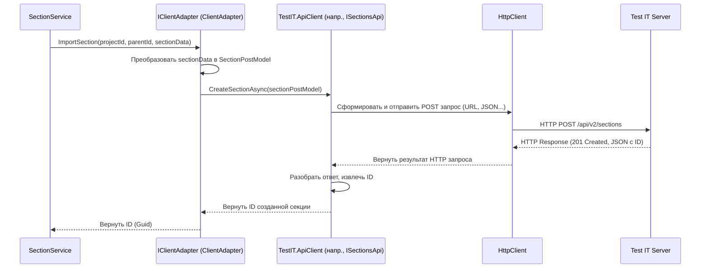

# Chapter 4: Адаптер API Test IT (IClientAdapter)


В [предыдущей главе](03_сервис_парсинга_данных__iparserservice__.md) мы научились использовать `IParserService`, нашего "библиотекаря", чтобы читать данные из файлов экспорта. Мы знаем, как получить информацию о секциях, тест-кейсах, общих шагах и вложениях. Отлично! Но как теперь передать всю эту информацию в систему Test IT? Просто прочитать данные недостаточно, их нужно *отправить* на сервер.

**Проблема:** Как нашему приложению `Importer` **общаться** с сервером Test IT? Как передать ему команду "создай вот эту секцию" или "загрузи вот этот файл"? Напрямую работать с HTTP-запросами, знать все нужные URL-адреса (эндпоинты), правильно формировать JSON в теле запроса, обрабатывать ответы и ошибки – это довольно сложно и громоздко, особенно для новичков.

**Решение:** Для элегантного решения этой задачи в `Importer` есть **Адаптер API Test IT**, представленный интерфейсом `IClientAdapter`. Вспоминаете нашу аналогию из описания? Это как **переводчик и дипломат** в одном лице.
*   Как **переводчик**, он знает "язык", на котором говорит API Test IT (специфические форматы запросов, адреса эндпоинтов).
*   Как **дипломат**, он берет простые поручения от других сервисов (например, "создай проект с именем 'Мой проект'") и выполняет всю необходимую "дипломатическую работу": формирует официальный запрос на "языке" API, отправляет его по нужному адресу, получает ответ и сообщает результат ("Проект успешно создан, вот его ID").

Он скрывает от остальной части приложения все сложности сетевого взаимодействия, делая общение с Test IT простым и понятным.

## Что умеет наш "Переводчик-Дипломат"? (Интерфейс `IClientAdapter`)

Интерфейс `IClientAdapter` определяет список "поручений" (методов), которые наш адаптер может выполнить. Он знает, как взаимодействовать с Test IT для всех основных операций импорта:

*   Найти проект по имени (`GetProject`).
*   Создать новый проект (`CreateProject`).
*   Импортировать (создать) секцию (`ImportSection`).
*   Импортировать (создать) пользовательский атрибут (`ImportAttribute`).
*   Получить информацию об атрибуте (`GetAttribute`).
*   Импортировать (создать) общий шаг (`ImportSharedStep`).
*   Импортировать (создать) тест-кейс (`ImportTestCase`).
*   Загрузить файл вложения (`UploadAttachment`).
*   Работать с параметрами (`CreateParameter`, `GetParameter`).
*   И многое другое (получение корневой секции, атрибутов проекта и т.д.).

Вот как выглядит часть этого интерфейса (контракта):

```csharp
// Файл: Client/IClientAdapter.cs (Упрощенный фрагмент)
namespace Importer.Client;

using Importer.Models; // Модели данных, которые получает адаптер
using Models; // Модели данных, специфичные для TMS (Test IT)
using Attribute = Models.Attribute; // Уточнение, что Attribute - это наша модель

public interface IClientAdapter
{
    // Найти проект по имени или создать новый
    Task<Guid> GetProject(string name);
    Task<Guid> CreateProject(string name);

    // Импортировать секцию в указанный проект и родительскую секцию
    Task<Guid> ImportSection(Guid projectId, Guid parentSectionId, Section section);

    // Импортировать тест-кейс
    Task ImportTestCase(Guid projectId, Guid parentSectionId, TmsTestCase testCase);

    // Загрузить вложение и вернуть его ID
    Task<Guid> UploadAttachment(string fileName, Stream content);

    // ... другие методы для атрибутов, общих шагов, параметров ...
}
```

**Объяснение:**

*   Этот интерфейс – просто список обещаний. Он говорит: "Любой класс, реализующий `IClientAdapter`, *должен* уметь выполнять эти действия".
*   Обратите внимание на типы данных: методы принимают понятные объекты (например, `Section` или `TmsTestCase` из [Главы 5](05_модели_данных_tms__tmstestcase__tmsattribute_и_др___.md)), а возвращают результат (часто `Guid` – уникальный идентификатор созданного объекта в Test IT).
*   Методы являются асинхронными (`async Task`), потому что сетевые операции могут занимать время, и приложение не должно "зависать" в ожидании ответа.

**Кто использует `IClientAdapter`?**

В основном, его используют [Сервисы импорта сущностей](06_сервисы_импорта_сущностей__iattributeservice__isectionservice__itestcaseservice_и_др___.md). Например, `SectionService`, получив данные о секции от `IParserService`, попросит `IClientAdapter` создать эту секцию в Test IT:

```csharp
// Пример использования внутри SectionService (упрощенно)
// sectionService зависит от clientAdapter (IClientAdapter)

public async Task<Dictionary<Guid, Guid>> ImportSections(Guid projectId, /*...другие параметры...*/)
{
    // ... получаем данные секции 'sectionToImport' от IParserService ...
    // ... определяем родительскую секцию 'parentSectionId' ...

    // Просим адаптер создать секцию в Test IT
    Guid newSectionId = await clientAdapter.ImportSection(
        projectId,
        parentSectionId,
        sectionToImport // Передаем объект Section
    );

    // ... сохраняем newSectionId и продолжаем ...
}
```

Как видите, `SectionService` не нужно знать никаких деталей об HTTP или API Test IT. Он просто дает команду "дипломату".

## Как `IClientAdapter` общается с Test IT? (Внутреннее устройство)

Наш "переводчик-дипломат" не выполняет всю грязную работу сам. У него есть помощник – специальная библиотека `TestIT.ApiClient`, которая уже содержит готовые "фразы" (методы) для каждого действия в API Test IT.

**Процесс общения (на примере импорта секции):**

1.  **Запрос от Сервиса:** `SectionService` вызывает `clientAdapter.ImportSection(projectId, parentId, sectionData)`.
2.  **Подготовка "Дипломатической Ноты":** `ClientAdapter` (реализация `IClientAdapter`) берет полученные данные (`sectionData`) и преобразует их в специальный формат, понятный библиотеке `TestIT.ApiClient` (например, создает объект `SectionPostModel`).
3.  **Обращение к "Эксперту по Языку":** `ClientAdapter` использует соответствующий компонент из `TestIT.ApiClient` (например, `ISectionsApi`) и вызывает его метод, передавая подготовленные данные (например, `sectionsApi.CreateSectionAsync(sectionPostModel)`).
4.  **Отправка и Получение:** Библиотека `TestIT.ApiClient` формирует правильный HTTP-запрос (POST-запрос на нужный URL с JSON в теле), отправляет его на сервер Test IT, используя настроенный HTTP-клиент ([Глава 7](07_настройка_http_клиента_и_политики_повторов__extensions__.md)), и получает ответ.
5.  **Перевод Ответа:** `TestIT.ApiClient` разбирает HTTP-ответ, извлекает из него нужную информацию (например, ID созданной секции) и возвращает ее `ClientAdapter`.
6.  **Передача Результата:** `ClientAdapter` получает результат от `TestIT.ApiClient` и возвращает его вызвавшему сервису (`SectionService`).

**Диаграмма последовательности:**



**Что нужно Адаптеру для работы?**

Чтобы успешно выполнять свою работу, нашему "дипломату" нужно:

1.  **Адрес и "Пропуск"**: URL сервера Test IT и `PrivateToken` для аутентификации. Он получает их из [Конфигурации приложения (AppConfig)](02_конфигурация_приложения__appconfig__.md).
2.  **Транспорт**: Настроенный `HttpClient` для отправки запросов. Он получает его через `IHttpClientFactory`, который настраивается в [Главе 7](07_настройка_http_клиента_и_политики_повторов__extensions__.md).
3.  **"Разговорники" (`TestIT.ApiClient`):** Конкретные API-клиенты из библиотеки `TestIT.ApiClient` (например, `ISectionsApi`, `IWorkItemsApi`, `IAttachmentsApi` и т.д.), которые знают, как обращаться к конкретным частям API Test IT.

Все эти зависимости предоставляются автоматически с помощью механизма Внедрения Зависимостей (Dependency Injection), который мы обсуждали в [Главе 1](01_точка_входа_и_оркестрация_импорта__program__app__iimportservice__.md).

## Заглянем в Код: Реализация `ClientAdapter`

Реализация интерфейса `IClientAdapter` находится в классе `ClientAdapter`. Давайте посмотрим на ключевые части.

**1. Конструктор: Получение зависимостей**

```csharp
// Файл: Client/Implementations/ClientAdapter.cs (Конструктор и поля)
using Importer.Models; // AppConfig
using Microsoft.Extensions.Logging; // Логирование
using Microsoft.Extensions.Options; // Для IOptions<AppConfig>
using Models; // TmsTestCase, Section и др.
using TestIT.ApiClient.Api; // API клиенты: ISectionsApi, IWorkItemsApi и т.д.
// ... другие using ...

namespace Importer.Client.Implementations;

// ClientAdapter реализует интерфейс IClientAdapter
public class ClientAdapter : IClientAdapter
{
    private readonly ILogger<ClientAdapter> _logger;
    private readonly IOptions<AppConfig> _appConfig; // Доступ к конфигурации

    // API клиенты из TestIT.ApiClient, предоставленные через DI
    private readonly IAttachmentsApi _attachmentsApi;
    private readonly IProjectsApi _projectsApi;
    private readonly ISectionsApi _sectionsApi;
    private readonly ICustomAttributesApi _customAttributesApi;
    private readonly IWorkItemsApi _workItemsApi;
    // ... и другие API клиенты ...

    // Конструктор, куда система DI передает все необходимое
    public ClientAdapter(
        ILogger<ClientAdapter> logger,
        IOptions<AppConfig> appConfig, // Получаем конфигурацию
        IAttachmentsApi attachmentsApi, // Получаем API клиент для вложений
        IProjectsApi projectsApi,       // Получаем API клиент для проектов
        ISectionsApi sectionsApi,         // Получаем API клиент для секций
        // ... другие API клиенты ...
        ICustomAttributesApi customAttributesApi,
        IWorkItemsApi workItemsApi,
        IParametersApi parametersApi
    )
    {
        // Сохраняем полученные зависимости в полях класса
        _logger = logger;
        _appConfig = appConfig;
        _attachmentsApi = attachmentsApi;
        _projectsApi = projectsApi;
        _sectionsApi = sectionsApi;
        _customAttributesApi = customAttributesApi;
        _workItemsApi = workItemsApi;
        // ... сохранение остальных ...
    }

    // ... Реализация методов интерфейса IClientAdapter ...
}
```

**Объяснение:**

*   Класс `ClientAdapter` объявляет, что ему нужны логгер (`ILogger`), конфигурация (`IOptions<AppConfig>`) и различные API-клиенты (`IAttachmentsApi`, `IProjectsApi` и т.д.).
*   Система Dependency Injection автоматически создает и передает экземпляры всех этих зависимостей при создании `ClientAdapter`. Нам не нужно создавать их вручную.
*   Эти зависимости сохраняются в приватных полях для использования в методах адаптера.

**2. Пример реализации метода: `ImportSection`**

```csharp
// Файл: Client/Implementations/ClientAdapter.cs (Метод ImportSection)
public async Task<Guid> ImportSection(Guid projectId, Guid parentSectionId, Section section)
{
    _logger.LogInformation("Importing section {Name}", section.Name); // Логируем действие

    try
    {
        // 1. Подготавливаем модель для API Test IT
        // Создаем SectionPostModel - объект, который ожидает TestIT.ApiClient
        var model = new SectionPostModel(
            section.Name, // Используем данные из объекта section
            parentId: parentSectionId,
            projectId: projectId,
            attachments: []) // Вложения обрабатываются отдельно
        {
            // Преобразуем наши списки шагов в формат, ожидаемый API
            PreconditionSteps = section.PreconditionSteps.Select(s => new StepPostModel
            {
                Action = s.Action,
                Expected = s.Expected
            }).ToList(),
            PostconditionSteps = section.PostconditionSteps.Select(s => new StepPostModel
            {
                Action = s.Action,
                Expected = s.Expected
            }).ToList()
        };

        _logger.LogDebug("Importing section {@Section}", model); // Логируем детали запроса

        // 2. Вызываем метод API клиента TestIT.ApiClient
        // _sectionsApi - это наш экземпляр ISectionsApi, полученный в конструкторе
        var resp = await _sectionsApi.CreateSectionAsync(model); // Отправляем запрос

        // 3. Обрабатываем ответ
        _logger.LogDebug("Imported section {@Section}", resp); // Логируем полученный ответ
        _logger.LogInformation("Imported section {Name} with id {Id}", section.Name, resp.Id);

        // Возвращаем ID созданной секции
        return resp.Id;
    }
    catch (ApiException e) // Ловим специфичные ошибки API
    {
        _logger.LogError("API Error importing section {Name}: {StatusCode} {Response}",
            section.Name, e.ErrorCode, e.ErrorContent?.ToString());
        throw; // Перебрасываем исключение для обработки выше
    }
    catch (Exception e) // Ловим другие возможные ошибки
    {
        _logger.LogError("Could not import section {Name}: {Message}", section.Name, e.Message);
        throw;
    }
}
```

**Объяснение:**

1.  **Подготовка:** Метод получает стандартные параметры (`projectId`, `parentSectionId`) и объект `Section` (из [Главы 5](05_модели_данных_tms__tmstestcase__tmsattribute_и_др___.md)). Он "переводит" данные из `Section` в формат `SectionPostModel`, который понимает `TestIT.ApiClient`. Это и есть работа **переводчика**.
2.  **Вызов API:** Вызывается `_sectionsApi.CreateSectionAsync(model)`. В этот момент библиотека `TestIT.ApiClient` формирует и отправляет HTTP POST-запрос на сервер Test IT. Это работа **дипломата**, который знает, как правильно обратиться к Test IT.
3.  **Результат:** Метод получает ответ (`resp`), содержащий информацию о созданной секции (включая ее `Id`), логирует успех и возвращает `Id`.
4.  **Обработка ошибок:** Есть блоки `catch` для перехвата и логирования специфических ошибок API (`ApiException` из `TestIT.ApiClient`) или общих ошибок.

Похожим образом реализованы и другие методы `ClientAdapter` (для тест-кейсов, атрибутов, вложений и т.д.): они принимают данные в "нашем" формате, преобразуют их в формат `TestIT.ApiClient`, вызывают соответствующий метод API-клиента и возвращают результат.

**3. Пример реализации метода: `UploadAttachment`**

Этот метод интересен тем, что работает с потоком данных файла.

```csharp
// Файл: Client/Implementations/ClientAdapter.cs (Метод UploadAttachment)
public async Task<Guid> UploadAttachment(string fileName, Stream content)
{
    // Проверки входных данных
    if (string.IsNullOrEmpty(fileName))
        throw new ArgumentNullException(nameof(fileName));
    if (content == null)
        throw new ArgumentNullException(nameof(content));

    _logger.LogDebug("Uploading attachment {Name}", fileName);

    try
    {
        // Вызываем API клиент для загрузки вложений (_attachmentsApi)
        // Передаем ему объект FileParameter, который содержит:
        // - Имя файла (извлекаем из полного пути, если нужно)
        // - Поток данных (Stream), полученный, например, от IParserService
        // - Тип контента (можно использовать "application/octet-stream" как универсальный)
        var response = await _attachmentsApi.ApiV2AttachmentsPostAsync(
            new FileParameter(
                Path.GetFileName(fileName), // Используем только имя файла
                content: content,           // Сам поток данных
                contentType: MimeTypes.GetMimeType(fileName) ?? "application/octet-stream" // Пытаемся определить тип файла
            ));

        _logger.LogDebug("Uploaded attachment {@Response}", response); // Логируем ответ

        // Возвращаем ID загруженного файла
        return response.Id;
    }
    catch (Exception e)
    {
        _logger.LogError("Could not upload attachment {Name}: {Message}", fileName, e.Message);
        throw;
    }
}
```

**Объяснение:**

*   Метод получает имя файла и `Stream` (поток данных файла). Этот поток обычно приходит от [IParserService](03_сервис_парсинга_данных__iparserservice__.md).
*   Он использует `_attachmentsApi.ApiV2AttachmentsPostAsync`, передавая ему специальный объект `FileParameter`, содержащий имя файла и сам поток данных.
*   `TestIT.ApiClient` и `HttpClient` под капотом обрабатывают потоковую передачу данных на сервер (обычно через multipart/form-data запрос).
*   В результате возвращается ID загруженного файла в Test IT, который потом можно прикрепить к тест-кейсу или общему шагу.

## Заключение

В этой главе мы познакомились с ключевым компонентом для связи с внешним миром (Test IT) – `IClientAdapter`:

1.  **Роль:** Это наш "переводчик и дипломат", который отвечает за все взаимодействие с API Test IT.
2.  **Абстракция:** Интерфейс `IClientAdapter` определяет набор высокоуровневых операций (импорт секции, тест-кейса, загрузка файла), скрывая сложности HTTP и деталей API.
3.  **Реализация:** Класс `ClientAdapter` использует готовую библиотеку `TestIT.ApiClient` для выполнения реальных запросов к серверу.
4.  **Зависимости:** Он полагается на конфигурацию (`AppConfig`) для получения адреса/токена и на `IHttpClientFactory` / `TestIT.ApiClient` для фактического общения.
5.  **Польза:** Централизует всю логику общения с API, делает код сервисов импорта чище и проще для понимания.

Мы увидели, как `Importer` получает данные с помощью `IParserService` и как отправляет их в Test IT с помощью `IClientAdapter`. Но какие именно данные передаются между этими компонентами и адаптером? Об этом мы поговорим в следующей главе, посвященной моделям данных.

---

**Следующая глава:** [Глава 5: Модели данных TMS (TmsTestCase, TmsAttribute и др.)](05_модели_данных_tms__tmstestcase__tmsattribute_и_др___.md)

---

Generated by [AI Codebase Knowledge Builder](https://github.com/The-Pocket/Tutorial-Codebase-Knowledge)