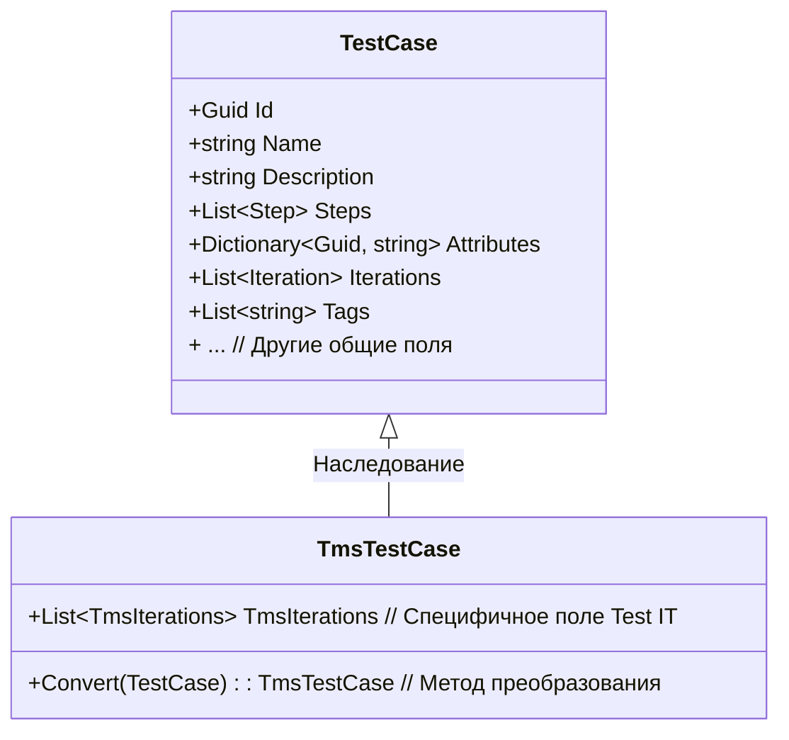

# Chapter 5: Модели данных TMS (TmsTestCase, TmsAttribute и др.)


В [предыдущей главе](04_адаптер_api_test_it__iclientadapter__.md) мы познакомились с `IClientAdapter` – нашим "переводчиком-дипломатом", который мастерски общается с API Test IT. Мы знаем, что сервисы импорта (вроде `TestCaseService`) могут попросить адаптер, например, "импортируй этот тест-кейс". Отлично, но в каком *формате* сервис должен передать данные об этом тест-кейсе адаптеру, чтобы API Test IT его понял?

**Проблема:** Представьте, что у нас есть общая информация о тест-кейсе, прочитанная из файла – название, шаги, атрибуты (`TestCase` из проекта `Models`). Но API Test IT может требовать дополнительные, специфичные для него сведения, которых нет в нашей общей модели. Например, Test IT поддерживает итерации (варианты) тест-кейсов, основанные на параметрах, а в нашей исходной модели `TestCase` такой концепции может не быть. Как передать эти специфичные данные? И как убедиться, что мы передаем данные именно в том виде, который ожидает `IClientAdapter` и, соответственно, API Test IT?

**Решение:** Для этого в `Importer` есть специальные **Модели Данных TMS**. Это классы, такие как `TmsTestCase`, `TmsAttribute`, `TmsIterations`, `TmsParameter`. Думайте о них как о **специализированных контейнерах** для данных. У нас есть базовые "контейнеры" (например, `TestCase` из проекта `Models`, описывающий тест-кейс в общем виде). Но чтобы "отправить посылку" именно в Test IT, нам нужны контейнеры с дополнительными "этикетками" или "отсеками", которые требует Test IT. Модели TMS – это и есть эти доработанные контейнеры. Они наследуют (или используют) базовые модели и добавляют поля, специфичные для Test IT, гарантируя, что `IClientAdapter` получит данные в нужном формате.

## Зачем Нужны Отдельные Модели TMS?

Может показаться избыточным иметь два набора моделей (базовые в `Models` и специфичные для TMS в `Importer`). Но это разделение важно:

1.  **Специфика Test IT:** Модели TMS содержат поля, которые имеют смысл *только* в контексте Test IT (например, `TmsIterations` для тест-кейсов). Базовые модели остаются чистыми и универсальными.
2.  **Четкий Контракт для Адаптера:** `IClientAdapter` ожидает данные именно в формате моделей TMS. Это делает его интерфейс ясным и предсказуемым. Сервисы импорта точно знают, какой "контейнер" нужно подготовить.
3.  **Гибкость:** Если в будущем мы захотим добавить поддержку импорта в другую TMS, мы сможем создать новый набор моделей (например, `JiraTestCase`), не изменяя базовые модели или существующие модели TMS для Test IT.

## Ключевые Модели TMS

Давайте рассмотрим основные модели, используемые для передачи данных в `IClientAdapter`:

### 1. `TmsTestCase` (Модель Тест-Кейса для TMS)

Это, пожалуй, самая важная модель. Она представляет тест-кейс в формате, готовом для отправки в Test IT.

*   **Наследует от `TestCase`:** `TmsTestCase` является расширением базового класса `TestCase` (из проекта `Models`). Это значит, что он автоматически включает все поля `TestCase` (имя, шаги, атрибуты, теги и т.д.).
*   **Добавляет Специфику Test IT:** Основное добавление – это поле `TmsIterations`. Test IT позволяет создавать итерации (варианты выполнения) тест-кейса на основе разных наборов параметров. `TmsIterations` содержит информацию об этих параметрах.

```csharp
// Файл: Models/TmsTestCase.cs
using Models; // Используем базовую модель TestCase

namespace Importer.Models;

// TmsTestCase наследует всю функциональность TestCase
public class TmsTestCase : TestCase
{
    // Добавляем поле, специфичное для Test IT - информация об итерациях
    public List<TmsIterations> TmsIterations { get; set; } = new();

    // Вспомогательный метод для преобразования базового TestCase в TmsTestCase
    public static TmsTestCase Convert(TestCase testCase)
    {
        return new TmsTestCase
        {
            Id = testCase.Id,
            Description = testCase.Description,
            State = testCase.State,
            Priority = testCase.Priority,
            Steps = testCase.Steps,
            PreconditionSteps = testCase.PreconditionSteps,
            PostconditionSteps = testCase.PostconditionSteps,
            Duration = testCase.Duration,
            Attributes = testCase.Attributes,
            Tags = testCase.Tags,
            Attachments = testCase.Attachments,
            Iterations = testCase.Iterations, // Исходные итерации (если есть в базовой модели)
            Links = testCase.Links,
            Name = testCase.Name,
            SectionId = testCase.SectionId,
            TmsIterations = PrepareTmsIterations(testCase.Iterations) // Подготовка специфичных для TMS итераций
        };
    }

    // Пример внутренней логики подготовки TmsIterations (упрощенно)
    private static List<TmsIterations> PrepareTmsIterations(List<Iteration> baseIterations)
    {
        var tmsIterations = new List<TmsIterations>();
        // ... логика преобразования Iteration в TmsIterations ...
        // Например, группировка параметров по итерациям
        // foreach (var iteration in baseIterations) { ... }
        return tmsIterations;
    }
}
```

**Объяснение:**

*   `public class TmsTestCase : TestCase`: Ключевой момент – наследование. `TmsTestCase` берет все от `TestCase`.
*   `public List<TmsIterations> TmsIterations { get; set; } = new();`: Добавляется новое свойство `TmsIterations`, которого нет в базовом `TestCase`. Это список объектов `TmsIterations`.
*   `Convert(TestCase testCase)`: Статический метод (необязательный, но удобный) для создания `TmsTestCase` из базового `TestCase`. Он копирует все общие поля и может содержать логику для заполнения специфичных полей (например, `TmsIterations`) на основе данных из `TestCase`.

**Как это выглядит схематично:**



### 2. `TmsIterations` и `TmsParameter` (Итерации и Параметры)

Эти модели используются внутри `TmsTestCase` для описания итераций на основе параметров в Test IT.

```csharp
// Файл: Models/TmsIterations.cs
namespace Importer.Models;

// Описывает одну итерацию (набор параметров) для Test IT
public class TmsIterations
{
    // Список ID параметров, входящих в эту итерацию
    public List<Guid> Parameters { get; set; } = new();
}
```

```csharp
// Файл: Models/TmsParameter.cs
namespace Importer.Models;

// Описывает один параметр (ключ-значение) для Test IT
public class TmsParameter
{
    public Guid Id { get; set; } // ID значения параметра в Test IT
    public string Value { get; set; } = string.Empty; // Значение параметра (например, "Chrome", "1024x768")
    public string Name { get; set; } = string.Empty; // Имя ключа параметра (например, "Браузер", "Разрешение")
    public Guid ParameterKeyId { get; set; } // ID ключа параметра в Test IT
}
```

**Объяснение:**

*   `TmsParameter`: Представляет конкретное значение параметра (например, "Браузер" = "Chrome"). Содержит `Value` (значение), `Name` (имя ключа, для информации) и ID ключа (`ParameterKeyId`) и ID самого значения (`Id`) в Test IT (эти ID получаются при создании или поиске параметров через `IClientAdapter`).
*   `TmsIterations`: Представляет одну комбинацию параметров для тест-кейса. Содержит просто список `Guid`ов - это ID (`TmsParameter.Id`) тех значений параметров, которые составляют данную итерацию.

### 3. `TmsAttribute` и `TmsAttributeOptions` (Пользовательские Атрибуты)

Эти модели представляют пользовательские атрибуты (custom fields) в Test IT. Хотя базовая модель `TestCase` может содержать словарь атрибутов (`Dictionary<Guid, string>`), для создания или обновления атрибутов в Test IT через API требуется более подробная информация, которую и хранят эти классы.

```csharp
// Файл: Models/TmsAttribute.cs
namespace Importer.Models;

// Описывает пользовательский атрибут в Test IT
public class TmsAttribute
{
    public Guid Id { get; set; } // ID атрибута в Test IT
    public string Name { get; set; } = string.Empty; // Имя атрибута
    public bool IsEnabled { get; set; } // Включен ли атрибут
    public bool IsRequired { get; set; } // Обязателен ли для заполнения
    public string Type { get; set; } = string.Empty; // Тип атрибута (например, "options", "string", "number")
    public bool IsGlobal { get; set; } // Глобальный ли атрибут (для всех проектов)
    // Список возможных значений для атрибутов типа "options" (выпадающий список)
    public List<TmsAttributeOptions> Options { get; set; } = new();
}
```

```csharp
// Файл: Models/TmsAttributeOptions.cs
namespace Importer.Models;

// Описывает один вариант значения для атрибута типа "options"
public class TmsAttributeOptions
{
    public Guid Id { get; set; } // ID опции в Test IT
    public string Value { get; set; } = string.Empty; // Текстовое значение опции
    public bool IsDefault { get; set; } // Является ли значением по умолчанию
}
```

**Объяснение:**

*   `TmsAttribute`: Хранит полную информацию об атрибуте, как она представлена в Test IT: имя, тип, обязательность, глобальность и, для списковых атрибутов, его возможные значения (`Options`).
*   `TmsAttributeOptions`: Описывает один конкретный вариант выбора в атрибуте типа "options".

Эти модели используются [Сервисом импорта атрибутов (IAttributeService)](06_сервисы_импорта_сущностей__iattributeservice__isectionservice__itestcaseservice_и_др___.md) для передачи данных в `IClientAdapter`, когда нужно создать или обновить атрибуты в проекте Test IT.

## Как Используются Модели TMS?

Основная идея – подготовить данные в формате этих TMS-моделей перед передачей их в `IClientAdapter`.

**Примерный поток для импорта тест-кейса:**

1.  **Чтение Базовых Данных:** [Сервис импорта тест-кейсов (ITestCaseService)](06_сервисы_импорта_сущностей__iattributeservice__isectionservice__itestcaseservice_и_др___.md) получает список ID тест-кейсов из `Main.json` (через `IParserService`).
2.  **Получение Деталей:** Для каждого ID сервис вызывает `parserService.GetTestCase(guid)` и получает объект базовой модели `TestCase`.
3.  **Преобразование в TMS Модель:** Сервис `ITestCaseService` преобразует полученный `TestCase` в `TmsTestCase`. Это может включать:
    *   Простое копирование общих полей.
    *   Обработку атрибутов: возможно, нужно найти ID атрибутов и их значений в Test IT (используя `IAttributeService` и `IClientAdapter`) и сохранить их в нужном формате.
    *   Обработку итераций: если в базовой модели есть информация об итерациях (`testCase.Iterations`), ее нужно преобразовать в `TmsIterations`, возможно, также создав или найдя нужные параметры (`TmsParameter`) в Test IT через `IClientAdapter`.
    *   Обработку вложений: загрузить вложения через `clientAdapter.UploadAttachment()` и сохранить их ID.
4.  **Передача в Адаптер:** Готовый объект `TmsTestCase` передается в метод `clientAdapter.ImportTestCase(projectId, sectionId, tmsTestCase)`.
5.  **Внутри Адаптера:** `ClientAdapter` берет данные из `TmsTestCase`, преобразует их в еще более низкоуровневые модели, ожидаемые библиотекой `TestIT.ApiClient` (например, `WorkItemPostModel`), и отправляет запрос в API Test IT.

**Пример кода (Очень Упрощенно):**

```csharp
// Внутри TestCaseService (или подобного сервиса)

// Получаем базовый тест-кейс от парсера
TestCase baseTestCase = await _parserService.GetTestCase(testCaseId);

// Создаем TmsTestCase (возможно, через метод Convert или вручную)
TmsTestCase tmsTestCase = TmsTestCase.Convert(baseTestCase);

// Дополнительная подготовка TmsTestCase (очень упрощенно!)
// Например, "разрешаем" атрибуты и параметры, получая их ID из Test IT
tmsTestCase.Attributes = await ResolveAttributes(baseTestCase.Attributes, projectId);
tmsTestCase.TmsIterations = await ResolveIterations(baseTestCase.Iterations, projectId);
// Загружаем вложения и сохраняем их ID
var attachmentIds = await UploadAttachments(baseTestCase.Attachments, testCaseId);
// (Логика добавления attachmentIds в tmsTestCase опущена для простоты)

// Передаем подготовленный TmsTestCase в адаптер
await _clientAdapter.ImportTestCase(projectId, sectionId, tmsTestCase);

// ----- Вспомогательные методы (псевдокод) -----
async Task<Dictionary<Guid, string>> ResolveAttributes(Dictionary<Guid, string> attributes, Guid projectId)
{
    var resolvedAttributes = new Dictionary<Guid, string>();
    // Для каждого атрибута:
    // 1. Найти ID атрибута в Test IT по его имени/исходному ID (через IAttributeService/IClientAdapter)
    // 2. Найти ID значения атрибута в Test IT (если это список)
    // 3. Добавить в resolvedAttributes пару {TmsAttributeId, TmsOptionId или Значение}
    return resolvedAttributes;
}

async Task<List<TmsIterations>> ResolveIterations(List<Iteration> iterations, Guid projectId)
{
    var tmsIterations = new List<TmsIterations>();
    // Для каждой итерации:
    // 1. Для каждого параметра в итерации найти/создать его ключ и значение в Test IT (через IClientAdapter.GetParameter/CreateParameter) -> получить TmsParameter.Id
    // 2. Собрать список ID параметров (TmsParameter.Id) для этой итерации
    // 3. Создать объект TmsIterations с этим списком ID
    // 4. Добавить в tmsIterations
    return tmsIterations;
}

async Task<List<Guid>> UploadAttachments(List<string> attachments, Guid testCaseId)
{
    var ids = new List<Guid>();
    // Для каждого имени файла вложения:
    // 1. Получить поток файла от парсера: parserService.GetAttachment(testCaseId, fileName)
    // 2. Загрузить через адаптер: clientAdapter.UploadAttachment(fileName, stream) -> получить ID
    // 3. Добавить ID в список ids
    return ids;
}
```

**Важно:** Этот пример сильно упрощен. Реальная логика в `ITestCaseService` (и других сервисах) выполняет больше шагов по "разрешению" (resolving) связей – поиску или созданию необходимых сущностей (атрибутов, параметров, секций) в Test IT перед тем, как сформировать финальный объект `TmsTestCase` для импорта.

## Заключение

В этой главе мы рассмотрели **Модели данных TMS** (`TmsTestCase`, `TmsAttribute`, `TmsIterations` и др.):

1.  **Назначение:** Они служат специализированными **контейнерами** для передачи данных в `IClientAdapter` в формате, точно соответствующем требованиям API Test IT.
2.  **Особенности:** Часто они **наследуют** базовые модели (как `TmsTestCase` от `TestCase`) и добавляют **специфичные для Test IT поля** (как `TmsIterations`).
3.  **Использование:** Сервисы импорта (рассмотрим их в следующей главе) отвечают за **преобразование** базовых моделей (полученных от `IParserService`) в эти TMS-модели, выполняя при необходимости запросы к Test IT через `IClientAdapter` для получения нужных ID (атрибутов, параметров и т.д.), и затем передают готовые TMS-модели в `IClientAdapter` для фактического создания сущностей в Test IT.
4.  **Польза:** Они обеспечивают **четкий контракт** между сервисами импорта и адаптером API, инкапсулируют специфику Test IT и делают систему более гибкой.

Теперь, когда мы знаем, *какие* данные передаются адаптеру, в следующей главе мы подробно рассмотрим сервисы, которые *управляют* процессом импорта для каждой конкретной сущности (атрибутов, секций, тест-кейсов), используя парсер, модели TMS и адаптер API.

---

**Следующая глава:** [Глава 6: Сервисы импорта сущностей (IAttributeService, ISectionService, ITestCaseService и др.)](06_сервисы_импорта_сущностей__iattributeservice__isectionservice__itestcaseservice_и_др___.md)

---

Generated by [AI Codebase Knowledge Builder](https://github.com/The-Pocket/Tutorial-Codebase-Knowledge)