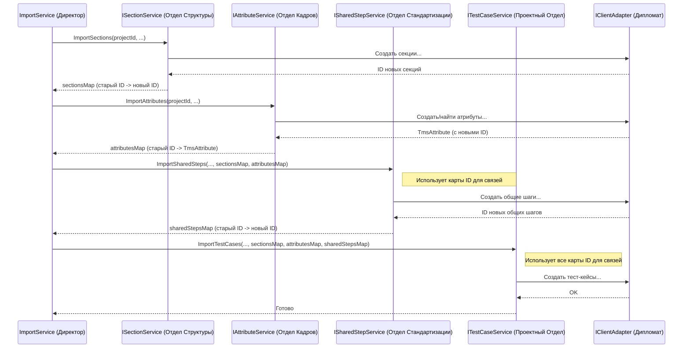

# Chapter 6: Сервисы импорта сущностей (IAttributeService, ISectionService, ITestCaseService и др.)


В [предыдущей главе](05_модели_данных_tms__tmstestcase__tmsattribute_и_др___.md) мы разобрались с моделями данных TMS, такими как `TmsTestCase`. Мы поняли, что это специальные "контейнеры", которые хранят информацию в формате, понятном для нашего "переводчика-дипломата" — [Адаптера API Test IT (IClientAdapter)](04_адаптер_api_test_it__iclientadapter__.md). Теперь у нас есть данные, прочитанные [Парсером (IParserService)](03_сервис_парсинга_данных__iparserservice__.md), и подготовленные "контейнеры" (модели TMS). Но кто же возьмет эти контейнеры и даст команду адаптеру отправить их в Test IT?

**Проблема:** Импорт разных вещей (атрибутов, папок, тест-кейсов) требует разной логики. Нельзя просто взять все данные разом и отправить. Нужно:
1.  **Знать порядок:** Сначала нужно создать атрибуты и структуру папок (секции), а уже потом импортировать тест-кейсы, которые их используют.
2.  **Учитывать зависимости:** Тест-кейс может ссылаться на общий шаг или атрибут. Перед импортом тест-кейса нужно убедиться, что эти зависимости уже существуют в Test IT, и получить их новые ID.
3.  **Обрабатывать специфику:** У каждого типа сущности (атрибут, секция, тест-кейс) своя логика создания и обновления в Test IT. Кто будет этим заниматься?

**Решение:** В `Importer` эту работу выполняют **Сервисы импорта сущностей**. Это набор специализированных сервисов, таких как `IAttributeService`, `ISectionService`, `ITestCaseService` и других. Представьте большую компанию (весь процесс импорта). У нее есть генеральный директор — [IImportService](01_точка_входа_и_оркестрация_импорта__program__app__iimportservice__.md), который ставит общую задачу. Но для выполнения конкретных задач директор обращается к **руководителям отделов**:
*   `IAttributeService`: Начальник отдела кадров. Отвечает за все, что связано с пользовательскими атрибутами (поля тест-кейсов).
*   `ISectionService`: Глава отдела организационной структуры. Занимается созданием структуры папок (секций) в проекте.
*   `ITestCaseService`: Руководитель проектного отдела. Отвечает за импорт самих тест-кейсов со всеми деталями.
*   `ISharedStepService`: Начальник отдела стандартизации. Импортирует общие (переиспользуемые) шаги.
*   `IParameterService`: Специалист по параметрам. Создает параметры и их значения для параметризованных тестов.
*   `IAttachmentService`: Сотрудник архива. Помогает загружать вложения.

Каждый такой "руководитель отдела" (сервис) получает данные от [IParserService](03_сервис_парсинга_данных__iparserservice__.md), подготавливает их (используя [Модели данных TMS](05_модели_данных_tms__tmstestcase__tmsattribute_и_др___.md)), а затем поручает нашему "дипломату" — [IClientAdapter](04_адаптер_api_test_it__iclientadapter__.md) — отправить эти данные в Test IT. Важно, что они также обрабатывают специфическую логику и зависимости для *своего* типа сущности.

## Ключевые "Руководители Отделов" и их Задачи

Давайте подробнее рассмотрим, чем занимается каждый из основных сервисов.

### 1. `IAttributeService` (Отдел Кадров - Атрибуты)

**Задача:** Импортировать пользовательские атрибуты в проект Test IT.
*   **Получает:** Список атрибутов из `Main.json` (через `IParserService`).
*   **Использует:** `IClientAdapter` для:
    *   Получения существующих атрибутов в проекте Test IT (`GetProjectAttributes`).
    *   Создания новых атрибутов, если их нет (`ImportAttribute`).
    *   Обновления существующих (например, добавления новых опций в выпадающий список) (`UpdateAttribute`).
    *   Получения полной информации об атрибуте после создания/обновления (`GetAttribute`).
    *   Привязки импортированных атрибутов к проекту (`AddAttributesToProject`).
*   **Логика:**
    *   Проверяет, существует ли атрибут с таким именем в Test IT.
    *   Если нет - создает новый.
    *   Если есть, но тип не совпадает - создает новый с измененным именем (например, "Статус (1)").
    *   Если есть и тип совпадает - использует существующий и, если это список опций, добавляет недостающие варианты.
    *   Следит за обязательными атрибутами проекта.
*   **Возвращает:** Словарь `Dictionary<Guid, TmsAttribute>`. Этот словарь очень важен! Он сопоставляет *старый* ID атрибута (из файла импорта) с *новым* объектом `TmsAttribute`, содержащим его ID и всю информацию *в Test IT*. Этот словарь потом используется другими сервисами (например, `ITestCaseService`) чтобы правильно ссылаться на атрибуты.

**Пример кода (`AttributeService.cs`):**

```csharp
// Файл: Services/Implementations/AttributeService.cs (Фрагмент ImportAttributes)
internal class AttributeService : IAttributeService
{
    private readonly ILogger<AttributeService> _logger;
    private readonly IClientAdapter _clientAdapter;

    // Конструктор для получения зависимостей (логгер, адаптер)
    public AttributeService(ILogger<AttributeService> logger, IClientAdapter clientAdapter)
    {
        _logger = logger;
        _clientAdapter = clientAdapter;
    }

    public async Task<Dictionary<Guid, TmsAttribute>> ImportAttributes(Guid projectId,
        IEnumerable<Attribute> attributes) // Получаем ID проекта и список атрибутов из файла
    {
        _logger.LogInformation("Начинаем импорт атрибутов");
        // Словарь для хранения соответствия старых ID новым TmsAttribute
        var attributesMap = new Dictionary<Guid, TmsAttribute>();
        // Получаем существующие атрибуты из Test IT через адаптер
        var projectAttributes = await _clientAdapter.GetProjectAttributes();

        foreach (var attribute in attributes) // Обрабатываем каждый атрибут из файла
        {
            TmsAttribute? tmsAttribute = null;
            bool attributeIsNotImported = true;
            do
            {
                // Ищем атрибут с таким именем в Test IT
                var projectAttribute = projectAttributes.FirstOrDefault(x => x.Name == attribute.Name);

                if (projectAttribute == null) // Атрибута нет?
                {
                    _logger.LogInformation("Создаем атрибут {Name}", attribute.Name);
                    // Создаем через адаптер
                    tmsAttribute = await _clientAdapter.ImportAttribute(attribute);
                    tmsAttribute = await _clientAdapter.GetAttribute(tmsAttribute.Id); // Получаем полную инфу
                    attributeIsNotImported = false;
                }
                else // Атрибут есть
                {
                     // Проверяем совпадение типов и обрабатываем опции (упрощено)
                    if (projectAttribute.Type == attribute.Type.ToString())
                    {
                         _logger.LogInformation("Атрибут {Name} уже существует с ID {Id}", projectAttribute.Name, projectAttribute.Id);
                         // Возможно, нужно обновить опции
                         // await _clientAdapter.UpdateAttribute(projectAttribute);
                         tmsAttribute = projectAttribute;
                         attributeIsNotImported = false;
                    }
                    else // Типы не совпадают - меняем имя и пробуем снова
                    {
                        attribute.Name = GetNewAttributeName(attribute, projectAttributes); // Генерируем имя типа "Name (1)"
                    }
                }
             } while(attributeIsNotImported);

            if (tmsAttribute != null)
            {
                 // Запоминаем соответствие старого ID новому объекту TmsAttribute
                 attributesMap.Add(attribute.Id, tmsAttribute);
            }
        }

        // Добавляем все импортированные/найденные атрибуты к проекту в Test IT
        if (attributesMap.Count > 0)
            await _clientAdapter.AddAttributesToProject(projectId, attributesMap.Values.Select(x => x.Id));

        _logger.LogInformation("Импорт атрибутов завершен");
        return attributesMap; // Возвращаем карту ID
    }
    // Вспомогательный метод для генерации нового имени
    private static string GetNewAttributeName(Attribute attribute, IEnumerable<TmsAttribute> attributes) { /* ... */ }
}
```

### 2. `ISectionService` (Отдел Структуры - Секции)

**Задача:** Создать структуру папок (секций) в проекте Test IT, точно такую же, как в исходных данных.
*   **Получает:** Список секций верхнего уровня из `Main.json`.
*   **Использует:** `IClientAdapter` для:
    *   Получения ID корневой секции проекта (`GetRootSectionId`).
    *   Создания новой секции внутри родительской (`ImportSection`).
*   **Логика:**
    *   Работает рекурсивно: для каждой секции создает ее в Test IT, получает ее новый ID, а затем вызывает себя же для всех вложенных в нее секций, передавая новый ID как родительский.
*   **Возвращает:** Словарь `Dictionary<Guid, Guid>`, сопоставляющий *старый* ID секции (из файла) с *новым* ID секции в Test IT. Этот словарь используется `ITestCaseService` и `ISharedStepService` для размещения тест-кейсов и общих шагов в правильные папки.

**Пример кода (`SectionService.cs`):**

```csharp
// Файл: Services/Implementations/SectionService.cs (Фрагмент ImportSections и ImportSection)
internal class SectionService : ISectionService
{
    private readonly ILogger<SectionService> _logger;
    private readonly IClientAdapter _clientAdapter;
    // Словарь для хранения карты ID [старый_Guid -> новый_Guid]
    private readonly Dictionary<Guid, Guid> _sectionsMap = new();

    public SectionService(ILogger<SectionService> logger, IClientAdapter clientAdapter)
    {
        _logger = logger;
        _clientAdapter = clientAdapter;
    }

    // Основной метод, вызываемый снаружи
    public async Task<Dictionary<Guid, Guid>> ImportSections(Guid projectId, IEnumerable<Section> sections)
    {
        _logger.LogInformation("Начинаем импорт секций");
        // Получаем ID корневой папки проекта в Test IT
        var rootSectionId = await _clientAdapter.GetRootSectionId(projectId);

        // Запускаем рекурсивный импорт для каждой секции верхнего уровня
        foreach (var section in sections)
        {
            await ImportSection(projectId, rootSectionId, section);
        }

        return _sectionsMap; // Возвращаем карту ID
    }

    // Рекурсивный метод для импорта одной секции и всех ее дочерних
    private async Task ImportSection(Guid projectId, Guid parentSectionId, Section section)
    {
        _logger.LogDebug("Импортируем секцию {Name} в родительскую секцию {Id}", section.Name, parentSectionId);

        // Создаем секцию в Test IT через адаптер, передавая ID родителя
        var sectionId = await _clientAdapter.ImportSection(projectId, parentSectionId, section);
        // Сохраняем соответствие старого ID новому ID
        _sectionsMap.Add(section.Id, sectionId);

        // Рекурсивно вызываем себя для всех дочерних секций
        foreach (var subSection in section.Sections)
        {
            await ImportSection(projectId, sectionId, subSection); // Передаем новый ID как родительский
        }

         _logger.LogDebug("Импортирована секция {Name} (Новый ID: {SectionId})", section.Name, sectionId);
    }
}
```

### 3. `ITestCaseService` (Проектный Отдел - Тест-Кейсы)

**Задача:** Импортировать тест-кейсы со всеми их деталями (шаги, атрибуты, вложения, ссылки на общие шаги, параметры, итерации). Это самый сложный сервис.
*   **Получает:** ID проекта, список ID тест-кейсов для импорта (из `Main.json`), а также *карты ID*, полученные от `IAttributeService`, `ISectionService`, `ISharedStepService`.
*   **Использует:**
    *   `IParserService`: Для получения полных данных каждого тест-кейса по его ID (`GetTestCase`).
    *   `IAttachmentService`: Для загрузки вложений, связанных с тест-кейсом.
    *   `IParameterService`: Для создания параметров и их значений (если тест-кейс параметризован).
    *   `IClientAdapter`: Для отправки финального, подготовленного `TmsTestCase` в Test IT (`ImportTestCase`).
*   **Логика:**
    1.  Для каждого ID тест-кейса из списка:
    2.  Получает базовые данные `TestCase` от `IParserService`.
    3.  **Преобразует** `TestCase` в `TmsTestCase` (специализированную модель для [IClientAdapter](04_адаптер_api_test_it__iclientadapter__.md), см. [Главу 5](05_модели_данных_tms__tmstestcase__tmsattribute_и_др___.md)).
    4.  **Разрешает зависимости (Resolving):**
        *   **Атрибуты:** Заменяет старые ID атрибутов на новые ID из карты `_attributesMap`, полученной от `IAttributeService`. Использует вспомогательный метод `ConvertAttributes`.
        *   **Общие шаги:** Заменяет старые ID общих шагов на новые ID из карты `_sharedSteps`, полученной от `ISharedStepService`.
        *   **Вложения:** Вызывает `IAttachmentService` для загрузки файлов (который, в свою очередь, использует `IParserService.GetAttachment` и `IClientAdapter.UploadAttachment`). Получает новые ID вложений и обновляет ссылки на них в шагах тест-кейса (использует `AddAttachmentsToSteps`).
        *   **Параметры и Итерации:** Если есть итерации, вызывает `IParameterService` для создания/поиска параметров в Test IT. Затем формирует структуру `TmsIterations` с новыми ID параметров. Обновляет текст шагов, вставляя в них ссылки на параметры в формате Test IT (использует `AddParameter`).
    5.  **Отправка:** Вызывает `clientAdapter.ImportTestCase`, передавая ID проекта, *новый* ID секции (из карты `_sectionsMap`) и полностью подготовленный `TmsTestCase`.
*   **Возвращает:** Ничего (`Task`), так как его задача - выполнить импорт.

**Пример кода (`TestCaseService.cs`):**

```csharp
// Файл: Services/Implementations/TestCaseService.cs (Фрагмент ImportTestCases и ImportTestCase)
internal class TestCaseService : BaseWorkItemService, ITestCaseService // Наследует BaseWorkItemService для помощи с атрибутами/вложениями
{
    private readonly ILogger<TestCaseService> _logger;
    private readonly IClientAdapter _clientAdapter;
    private readonly IParserService _parserService;
    private readonly IParameterService _parameterService;
    private readonly IAttachmentService _attachmentService;

    // Карты ID, полученные от других сервисов
    private Dictionary<Guid, TmsAttribute> _attributesMap = new();
    private Dictionary<Guid, Guid> _sectionsMap = new();
    private Dictionary<Guid, Guid> _sharedSteps = new();

    public TestCaseService(/* Конструктор для всех зависимостей */) { /* ... */ }

    public async Task ImportTestCases(Guid projectId, IEnumerable<Guid> testCases, Dictionary<Guid, Guid> sections,
        Dictionary<Guid, TmsAttribute> attributes, Dictionary<Guid, Guid> sharedSteps)
    {
        // Сохраняем карты ID для использования внутри сервиса
        _attributesMap = attributes;
        _sectionsMap = sections;
        _sharedSteps = sharedSteps;

        _logger.LogInformation("Начинаем импорт тест-кейсов");
        foreach (var testCaseId in testCases) // Обрабатываем каждый тест-кейс
        {
            try
            {
                // Получаем базовые данные
                var tc = await _parserService.GetTestCase(testCaseId);
                // Выполняем импорт одного тест-кейса
                await ImportTestCase(projectId, tc);
            }
            catch (Exception e) // Ловим ошибки для конкретного тест-кейса
            {
                _logger.LogError("Не удалось импортировать тест-кейс {Name}: {Message}", tc?.Name ?? testCaseId.ToString(), e.Message);
            }
        }
    }

    // Логика импорта одного тест-кейса
    private async Task ImportTestCase(Guid projectId, TestCase testCase)
    {
        // Находим новый ID секции по старому ID
        var sectionId = _sectionsMap[testCase.SectionId];
        _logger.LogDebug("Импортируем тест-кейс {Name} в секцию {Id}", testCase.Name, sectionId);

        // 1. Преобразуем в TmsTestCase (основная часть - простое копирование)
        var tmsTestCase = TmsTestCase.Convert(testCase);

        // 2. Разрешаем атрибуты (использует _attributesMap и TmsAttribute из нее)
        tmsTestCase.Attributes = ConvertAttributes(testCase.Attributes, _attributesMap);

        // 3. Разрешаем ссылки на общие шаги (использует _sharedSteps)
        tmsTestCase.Steps.Where(s => s.SharedStepId != null)
            .ToList()
            .ForEach(s => s.SharedStepId = _sharedSteps[s.SharedStepId!.Value]);

        // 4. Обрабатываем параметры и итерации
        if (testCase.Iterations.Any())
        {
            var iterations = new List<TmsIterations>();
            // ... (вызов _parameterService.CreateParameters для каждой итерации) ...
            // ... (формирование списка tmsTestCase.TmsIterations) ...
            // ... (обновление шагов с помощью AddParameter) ...
             _logger.LogDebug("Обработаны параметры и итерации для {Name}", testCase.Name);
        }

        // 5. Загружаем вложения и обновляем шаги
        // Вызываем AttachmentService -> ParserService.GetAttachment -> ClientAdapter.UploadAttachment
        var attachments = await _attachmentService.GetAttachments(testCase.Id, testCase.Attachments);
        tmsTestCase.Attachments = attachments.Select(a => a.Value.ToString()).ToList(); // Сохраняем новые ID вложений
        // Обновляем текст шагов, вставляя ссылки на загруженные файлы
        tmsTestCase.Steps = AddAttachmentsToSteps(tmsTestCase.Steps, attachments);
        tmsTestCase.PreconditionSteps = AddAttachmentsToSteps(tmsTestCase.PreconditionSteps, attachments);
        tmsTestCase.PostconditionSteps = AddAttachmentsToSteps(tmsTestCase.PostconditionSteps, attachments);

        // 6. Отправляем полностью готовый TmsTestCase в Test IT
        await _clientAdapter.ImportTestCase(projectId, sectionId, tmsTestCase);
        _logger.LogDebug("Импортирован тест-кейс {Name} в секцию {Id}", testCase.Name, sectionId);
    }
    // Вспомогательные методы AddParameter, ConvertAttributes, AddAttachmentsToSteps находятся в BaseWorkItemService или здесь
}
```

### 4. Остальные сервисы (`ISharedStepService`, `IParameterService`, `IAttachmentService`)

*   `ISharedStepService`: Работает очень похоже на `ITestCaseService`, но для общих шагов. Он также использует `IParserService` (`GetSharedStep`), разрешает атрибуты и вложения (`IAttachmentService`), и вызывает `IClientAdapter` (`ImportSharedStep`). Возвращает карту ID `Dictionary<Guid, Guid>` для общих шагов.
*   `IParameterService`: Отвечает только за создание/поиск параметров и их значений в Test IT через `IClientAdapter` (`GetParameter`, `CreateParameter`). Используется сервисом `ITestCaseService`. Возвращает список `TmsParameter` с ID из Test IT.
*   `IAttachmentService`: Сервис-помощник. Его главная задача - взять список имен файлов для сущности (тест-кейса или общего шага), получить потоки данных от `IParserService` и загрузить их через `IClientAdapter`, вернув карту `Dictionary<string, Guid>` (имя файла -> ID вложения в Test IT).

## Как они работают вместе: Оркестровка Импорта

Вспомним нашего "генерального директора" — [IImportService](01_точка_входа_и_оркестрация_импорта__program__app__iimportservice__.md). Именно он вызывает этих "руководителей отделов" в правильном порядке, передавая им необходимые данные, включая карты ID, полученные от предыдущих шагов.

```csharp
// Фрагмент из Services/Implementations/ImportService.cs
internal class ImportService : IImportService
{
    // ... зависимости от всех сервисов импорта ...
    private readonly IAttributeService _attributeService;
    private readonly ISectionService _sectionService;
    private readonly ISharedStepService _sharedStepService;
    private readonly ITestCaseService _testCaseService;
    // ...

    public async Task ImportProject()
    {
        // 1. Получить данные из Main.json
        var mainJsonResult = await _parserService.GetMainFile();
        // 2. Создать/найти проект
        var projectId = await _projectService.ImportProject(mainJsonResult.ProjectName);

        // 3. Импортировать секции (ISectionService) -> получить карту sectionMap
        var sectionMap = await _sectionService.ImportSections(projectId, mainJsonResult.Sections);

        // 4. Импортировать атрибуты (IAttributeService) -> получить карту attributesMap
        var attributesMap = await _attributeService.ImportAttributes(projectId, mainJsonResult.Attributes);

        // 5. Импортировать общие шаги (ISharedStepService)
        // Передаем карты sectionMap и attributesMap для разрешения зависимостей
        var sharedStepsMap = await _sharedStepService.ImportSharedSteps(projectId,
            mainJsonResult.SharedSteps, sectionMap, attributesMap);

        // 6. Импортировать тест-кейсы (ITestCaseService)
        // Передаем все карты: sectionMap, attributesMap, sharedStepsMap
        await _testCaseService.ImportTestCases(projectId, mainJsonResult.TestCases,
            sectionMap, attributesMap, sharedStepsMap);

        _logger.LogInformation("Импорт проекта завершен");
    }
}
```

**Диаграмма последовательности (упрощенный фокус на картах ID):**



Эта схема иллюстрирует ключевой момент: каждый сервис не только выполняет свою часть импорта, но и подготавливает "карту" (словарь ID), которая нужна следующим сервисам для правильной сборки связей между сущностями в Test IT.

## Заключение

В этой главе мы познакомились с командой "руководителей отделов" – **Сервисами импорта сущностей** (`IAttributeService`, `ISectionService`, `ITestCaseService` и др.):

1.  **Роль:** Каждый сервис специализируется на импорте определенного типа сущности (атрибуты, секции, тест-кейсы и т.д.).
2.  **Взаимодействие:** Они используют [IParserService](03_сервис_парсинга_данных__iparserservice__.md) для получения данных, [Модели TMS](05_модели_данных_tms__tmstestcase__tmsattribute_и_др___.md) для подготовки данных и [IClientAdapter](04_адаптер_api_test_it__iclientadapter__.md) для отправки их в Test IT.
3.  **Логика:** Реализуют специфическую логику для своего типа сущности, включая проверку существующих данных и **разрешение зависимостей** (атрибутов, секций, общих шагов, вложений, параметров).
4.  **Оркестровка:** Вызываются главным сервисом [IImportService](01_точка_входа_и_оркестрация_импорта__program__app__iimportservice__.md) в строгом порядке, передавая друг другу **карты ID (словари)** для корректной сборки связей в Test IT.
5.  **Польза:** Такое разделение ответственности делает код более организованным, понятным и легко расширяемым.

Мы почти завершили разбор основных компонентов `Importer`. В последней главе мы рассмотрим, как настраивается "транспорт" для нашего "дипломата" — HTTP-клиент, используемый для общения с API Test IT, включая важные детали, такие как обработка ошибок сети и политики повторных запросов.

---

**Следующая глава:** [Глава 7: Настройка HTTP Клиента и Политики Повторов (Extensions)](07_настройка_http_клиента_и_политики_повторов__extensions__.md)

---

Generated by [AI Codebase Knowledge Builder](https://github.com/The-Pocket/Tutorial-Codebase-Knowledge)