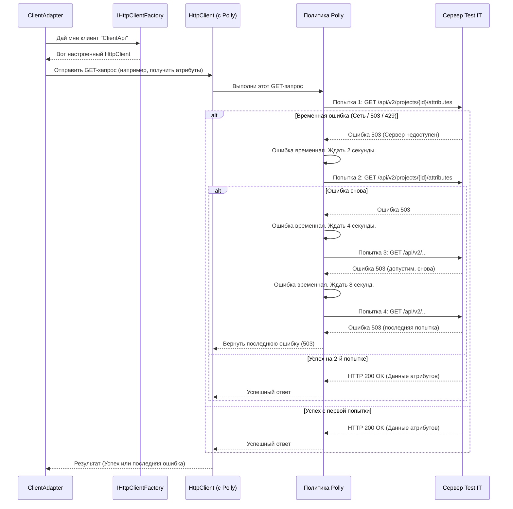

# Chapter 7: Настройка HTTP Клиента и Политики Повторов (Extensions)


В [предыдущей главе](06_сервисы_импорта_сущностей__iattributeservice__isectionservice__itestcaseservice_и_др___.md) мы познакомились с "руководителями отделов" – сервисами вроде `ITestCaseService`, которые отвечают за импорт конкретных сущностей (тест-кейсов, секций). Они используют [Адаптер API (IClientAdapter)](04_адаптер_api_test_it__iclientadapter__.md), нашего "дипломата", для отправки данных в Test IT. Но как именно этот "дипломат" общается с сервером Test IT? Что если сервер временно недоступен или отвечает слишком долго?

**Проблема:** Представьте, что вы пытаетесь открыть веб-сайт, но ваше интернет-соединение нестабильно. Иногда страница загружается сразу, иногда – нет. Или сайт очень медленно отвечает, и вы не хотите ждать вечно. Как должен вести себя ваш браузер? Должен ли он просто сдаться при первой же ошибке? Сколько раз ему стоит попытаться перезагрузить страницу? Доверять ли сертификату безопасности сайта? Подобные вопросы возникают и у нашего `Importer`, когда он общается с Test IT через сеть. Нам нужно настроить "сетевое поведение" нашего приложения.

**Решение:** Для настройки сетевого взаимодействия в `Importer` используются стандартные механизмы .NET вместе с библиотекой **Polly**. Это похоже на **настройку интернет-соединения и правил поведения** для вашего браузера:
1.  **`HttpClient`**: Это как бы внутренний "браузер" нашего приложения, который непосредственно отправляет запросы к API Test IT. Мы можем настроить, как долго он будет ждать ответа (тайм-аут) и доверять ли SSL-сертификату сервера.
2.  **`IHttpClientFactory`**: Фабрика, которая создает и управляет экземплярами `HttpClient`. Она помогает нам использовать "браузеры" эффективно и применять к ним общие настройки.
3.  **Polly**: Библиотека для повышения устойчивости. Она позволяет задать правила, что делать при сбоях. Самое распространенное – **политика повторов (retry policy)**: если запрос к Test IT не удался из-за временной сетевой проблемы, Polly автоматически попробует выполнить его еще несколько раз через определенные промежутки времени.
4.  **Методы Расширения (`Extensions`)**: Вся логика настройки `HttpClient` и Polly аккуратно собрана в специальных вспомогательных методах в папке `Extensions`. Это делает основной код настройки (`Program.cs`) чище и проще для понимания.

Эти настройки делают наш `Importer` более **надежным и устойчивым** к временным проблемам сети или сервера Test IT.

## Как это все настраивается?

Настройка "сетевого поведения" происходит один раз при запуске приложения, в файле `Program.cs`, с помощью методов из `Extensions/ServiceCollectionExtensions.cs`.

### Файл `Extensions/ServiceCollectionExtensions.cs` - Метод `RegisterClient`

Этот метод отвечает за регистрацию и настройку `HttpClient`, который будет использоваться для общения с Test IT.

```csharp
// Файл: Extensions/ServiceCollectionExtensions.cs
using Importer.Models; // Для AppConfig
using Microsoft.Extensions.DependencyInjection; // Основные методы DI
using Microsoft.Extensions.Options; // Для IOptions<AppConfig>
using Polly; // Для Policy

public static class ServiceCollectionExtensions
{
    // ... другие методы (например, RegisterAppConfig) ...

    public static void RegisterClient(this IServiceCollection services)
    {
        services.AddHttpClient("ClientApi", (sp, client) => // 1. Регистрируем именованный HttpClient
            {
                // Получаем конфигурацию приложения
                var config = sp.GetRequiredService<IOptions<AppConfig>>();
                // Устанавливаем таймаут из конфигурации (tms.config.json)
                client.Timeout = TimeSpan.FromSeconds(config.Value.Tms.Timeout);
            })
            // 2. Добавляем политику Polly (только для GET запросов)
            .AddPolicyHandler((provider, request) =>
                request.Method == HttpMethod.Get // Если это GET запрос...
                    ? provider.GetRetryPolicy() // ...применяем нашу политику повторов
                    : Policy.NoOpAsync<HttpResponseMessage>()) // ...иначе - ничего не делаем
            // 3. Настраиваем обработчик сообщений (для SSL)
            .ConfigurePrimaryHttpMessageHandler(sp =>
            {
                var handler = new SocketsHttpHandler // Современный обработчик
                {
                    // Настройки управления пулом соединений (для эффективности)
                    PooledConnectionLifetime = TimeSpan.FromMinutes(10),
                    PooledConnectionIdleTimeout = TimeSpan.FromMinutes(2)
                };

                // Получаем конфигурацию
                var config = sp.GetRequiredService<IOptions<AppConfig>>();
                var certValidation = config.Value.Tms.CertValidation;
                // Если в tms.config.json указано НЕ проверять сертификат...
                if (!certValidation)
                    // ...отключаем проверку SSL (НЕ РЕКОМЕНДУЕТСЯ для продакшена!)
                    handler.SslOptions.RemoteCertificateValidationCallback =
                        (_, _, _, _) => true;

                return handler; // Возвращаем настроенный обработчик
            });
    }
}
```

**Объяснение по шагам:**

1.  **`services.AddHttpClient("ClientApi", ...)`**: Мы регистрируем в системе DI "именованный" `HttpClient` с именем "ClientApi". Имя нужно, чтобы потом [Адаптер API (IClientAdapter)](04_адаптер_api_test_it__iclientadapter__.md) мог запросить именно этот, настроенный клиент. Внутри мы настраиваем:
    *   `client.Timeout`: Устанавливаем максимальное время ожидания ответа от сервера Test IT. Значение берется из [конфигурации (`AppConfig`)](02_конфигурация_приложения__appconfig__.md), которую пользователь задал в `tms.config.json`.
2.  **`.AddPolicyHandler(...)`**: Сюда подключается магия Polly! Мы говорим: "Для каждого запроса, выполняемого этим HttpClient, примени следующую логику":
    *   Проверяем, является ли запрос методом GET (`request.Method == HttpMethod.Get`). Обычно GET-запросы безопасны для повторения (они не изменяют данные).
    *   Если это GET, вызываем `provider.GetRetryPolicy()`. Это вспомогательный метод (мы рассмотрим его дальше), который возвращает настроенную политику повторов Polly.
    *   Если это не GET (например, POST-запрос на создание тест-кейса), мы используем `Policy.NoOpAsync`, что означает "никакой политики повторов не применять". Это сделано для безопасности, чтобы случайно не создать дубликаты сущностей при повторных POST-запросах.
3.  **`.ConfigurePrimaryHttpMessageHandler(...)`**: Здесь мы настраиваем самый низкий уровень отправки HTTP-запросов.
    *   Создаем `SocketsHttpHandler` (эффективный обработчик).
    *   Настраиваем параметры пула соединений для лучшей производительности.
    *   Самое важное: проверяем флаг `CertValidation` из [конфигурации (`AppConfig`)](02_конфигурация_приложения__appconfig__.md). Если пользователь установил его в `false` (например, для тестовой среды с самоподписанным сертификатом), мы отключаем стандартную проверку SSL-сертификата сервера Test IT. **Внимание:** Отключать проверку в реальных боевых условиях очень **небезопасно**!

### Файл `Extensions/ServiceProviderPolicyExtensions.cs` - Определение Политики Повторов

Метод `GetRetryPolicy`, который мы вызывали выше, определен в другом файле расширений:

```csharp
// Файл: Extensions/ServiceProviderPolicyExtensions.cs
using System.Net; // Для HttpStatusCode
using Importer.Client; // Для IClientAdapter (чтобы получить логгер)
using Microsoft.Extensions.DependencyInjection; // Для IServiceProvider
using Microsoft.Extensions.Logging; // Для ILogger
using Polly; // Основные компоненты Polly
using Polly.Extensions.Http; // Расширения Polly для HTTP
using Polly.Retry; // Для AsyncRetryPolicy

namespace Importer.Extensions;

internal static class ServiceProviderPolicyExtensions
{
    public static AsyncRetryPolicy<HttpResponseMessage> GetRetryPolicy(this IServiceProvider provider)
    {
        // Начинаем строить политику
        return HttpPolicyExtensions
            // 1. Определяем, какие ошибки считать "временными"
            .HandleTransientHttpError() // Стандартный набор: ошибки сети, 5xx (ошибки сервера)
            // 2. Добавляем еще один код ошибки к "временным"
            .OrResult(msg => msg.StatusCode == HttpStatusCode.TooManyRequests) // Код 429: Слишком много запросов (сервер просит подождать)
            // 3. Настраиваем стратегию ожидания и повтора
            .WaitAndRetryAsync(
                3, // Повторить максимум 3 раза
                retryAttempt => TimeSpan.FromSeconds(Math.Pow(2, retryAttempt)), // Экспоненциальная задержка: 2с, 4с, 8с
                (outcome, timespan, retryAttempt, context) => // Действие перед каждой повторной попыткой
                {
                    try
                    {
                        // Пытаемся получить логгер, чтобы записать предупреждение
                        var logger = provider.GetRequiredService<ILogger<IClientAdapter>>();
                        logger.LogWarning(
                            $"Повтор {retryAttempt} для GET {outcome?.Result?.RequestMessage?.RequestUri}");
                    }
                    catch (Exception)
                    {
                        // Игнорируем ошибку, если логгер не найден (маловероятно)
                    }
                });
    }
}
```

**Объяснение политики повторов:**

1.  **`HandleTransientHttpError()`**: Это стандартный помощник Polly, который говорит: "Считай временной ошибкой любую сетевую проблему (например, DNS не найден) или ответ сервера с кодом 5xx (ошибка на сервере)".
2.  **`.OrResult(msg => msg.StatusCode == HttpStatusCode.TooManyRequests)`**: Мы добавляем еще одно условие. Если сервер Test IT отвечает кодом 429 (`TooManyRequests`), это тоже считается временной проблемой, и стоит попробовать еще раз через некоторое время.
3.  **`.WaitAndRetryAsync(...)`**: Здесь определяется сама стратегия повторов:
    *   `3`: Делать максимум 3 повторные попытки (всего будет до 4 запросов: 1 оригинальный + 3 повторных).
    *   `retryAttempt => TimeSpan.FromSeconds(Math.Pow(2, retryAttempt))`: Это **экспоненциальная задержка**. Перед первой повторной попыткой (`retryAttempt = 1`) ждем 2^1 = 2 секунды. Перед второй (`retryAttempt = 2`) – 2^2 = 4 секунды. Перед третьей (`retryAttempt = 3`) – 2^3 = 8 секунд. Это помогает снизить нагрузку на сервер, если он перегружен.
    *   `(outcome, timespan, retryAttempt, context) => { ... }`: Действие, выполняемое *перед* каждой повторной попыткой. Здесь мы просто логируем (записываем в лог) информацию о том, что происходит повторная попытка, для какого запроса и какая она по счету.

**Итог:** Эта политика означает, что если GET-запрос к Test IT завершится неудачей (сетевая ошибка, ошибка 5xx или 429), `Importer` автоматически подождет 2 секунды и попробует снова. Если опять неудача – подождет 4 секунды и попробует еще раз. Если и третья попытка неудачна – подождет 8 секунд и попробует в последний раз. Если и она не удалась, то ошибка будет передана дальше в [Адаптер API (IClientAdapter)](04_адаптер_api_test_it__iclientadapter__.md), который уже обработает ее как окончательную.

## Как Это Работает "Под Капотом"?

Давайте посмотрим, как настроенный `HttpClient` и Polly взаимодействуют, когда [Адаптер API (IClientAdapter)](04_адаптер_api_test_it__iclientadapter__.md) пытается получить данные из Test IT (делает GET-запрос).

1.  **Запрос Клиента:** `ClientAdapter` (или используемая им библиотека `TestIT.ApiClient`) запрашивает у `IHttpClientFactory` клиент с именем "ClientApi".
2.  **Получение Настроенного Клиента:** Фабрика возвращает экземпляр `HttpClient`, к которому уже "прикреплены" настройки таймаута, обработчик SSL и политика повторов Polly (для GET-запросов).
3.  **Выполнение Запроса:** `ClientAdapter` использует этот `HttpClient` для отправки GET-запроса на сервер Test IT.
4.  **Перехват Polly:** Политика Polly, прикрепленная к клиенту, перехватывает исходящий запрос.
5.  **Первая Попытка:** Polly выполняет запрос к серверу Test IT.
6.  **Анализ Ответа:**
    *   **Успех:** Если сервер отвечает успешно (например, код 200 OK), Polly просто передает этот ответ обратно `ClientAdapter`.
    *   **Временная Ошибка:** Если происходит ошибка, подпадающая под условия политики (`HandleTransientHttpError` или 429), Polly не передает ошибку сразу.
7.  **Ожидание и Повтор:** Polly вычисляет время ожидания (например, 2 секунды для первой повторной попытки), ждет это время, а затем выполняет запрос к Test IT снова.
8.  **Цикл Повторов:** Шаги 6 и 7 повторяются до тех пор, пока:
    *   Либо запрос не будет выполнен успешно.
    *   Либо не будет достигнуто максимальное количество повторов (в нашем случае – 3).
9.  **Финальный Результат:** Если все повторы не увенчались успехом, Polly передает последнюю полученную ошибку обратно `ClientAdapter`.

**Диаграмма Последовательности:**



Эта диаграмма показывает, как Polly действует как "прослойка", которая автоматически обрабатывает временные сбои, прежде чем вернуть окончательный результат или ошибку вызывающему коду (`ClientAdapter`).

## Заключение

В этой последней главе нашего тура по `Importer` мы узнали, как настраивается его "сетевое поведение" с помощью `HttpClient`, `IHttpClientFactory` и **Polly**:

1.  **Настройка `HttpClient`**: Мы задаем важные параметры, такие как **таймаут** ожидания ответа и **проверка SSL-сертификата**, используя значения из [конфигурации](02_конфигурация_приложения__appconfig__.md).
2.  **Политики Устойчивости (Polly)**: Мы используем Polly для автоматического **повторения GET-запросов** при возникновении временных сетевых проблем или ошибок сервера (например, 5xx или 429 `TooManyRequests`). Используется **экспоненциальная задержка** между попытками.
3.  **Методы Расширения (`Extensions`)**: Вся логика настройки инкапсулирована в методах расширения (`RegisterClient`, `GetRetryPolicy`), что делает код в `Program.cs` чистым и декларативным.
4.  **Надежность**: Благодаря этим настройкам, `Importer` становится значительно **более устойчивым** к кратковременным сбоям в сети или на сервере Test IT, что повышает шансы на успешный импорт данных.

Мы рассмотрели все ключевые компоненты `Importer`: от точки входа и конфигурации до парсинга данных, взаимодействия с API Test IT через адаптер, использования моделей данных, работы специализированных сервисов импорта и, наконец, настройки надежности сетевого взаимодействия. Теперь у вас есть полное представление о внутренней архитектуре этого инструмента!

---

Generated by [AI Codebase Knowledge Builder](https://github.com/The-Pocket/Tutorial-Codebase-Knowledge)