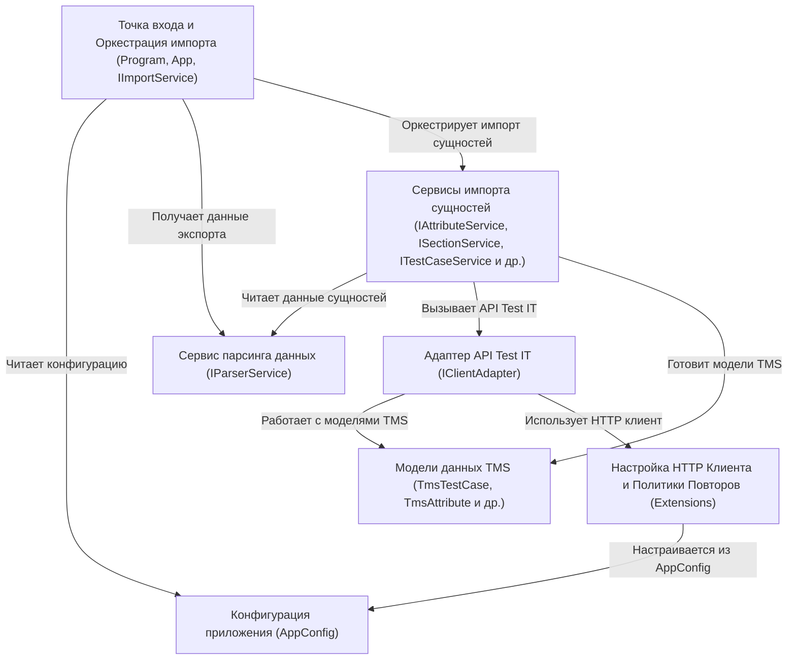

# Tutorial: Importer

Проект **Importer** представляет собой *консольное приложение*, предназначенное для **миграции** данных (тест-кейсов, секций, атрибутов и т.д.) из формата экспорта в систему управления тестированием **Test IT TMS**.
Он читает *конфигурационный файл* (`tms.config.json`) для получения параметров подключения к Test IT и пути к экспортированным данным.
Затем он *парсит* эти данные и, используя **API Test IT**, последовательно *импортирует* все сущности в указанный проект.

**Source Repository:** [None](None)

## Chapters

1. [Точка входа и Оркестрация импорта (Program, App, IImportService)
](01_точка_входа_и_оркестрация_импорта__program__app__iimportservice__.md)
2. [Конфигурация приложения (AppConfig)
](02_конфигурация_приложения__appconfig__.md)
3. [Сервис парсинга данных (IParserService)
](03_сервис_парсинга_данных__iparserservice__.md)
4. [Адаптер API Test IT (IClientAdapter)
](04_адаптер_api_test_it__iclientadapter__.md)
5. [Модели данных TMS (TmsTestCase, TmsAttribute и др.)
](05_модели_данных_tms__tmstestcase__tmsattribute_и_др___.md)
6. [Сервисы импорта сущностей (IAttributeService, ISectionService, ITestCaseService и др.)
](06_сервисы_импорта_сущностей__iattributeservice__isectionservice__itestcaseservice_и_др___.md)
7. [Настройка HTTP Клиента и Политики Повторов (Extensions)
](07_настройка_http_клиента_и_политики_повторов__extensions__.md)

---

Generated by [AI Codebase Knowledge Builder](https://github.com/The-Pocket/Tutorial-Codebase-Knowledge)